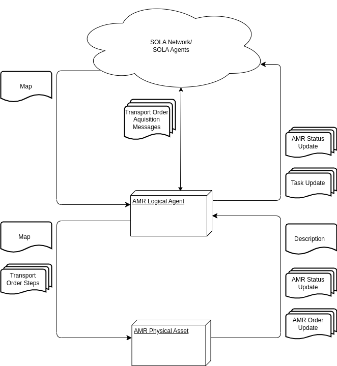

<!--# TODO löschen: Material Flow

Hierarchy

- Material Flow
- Task
- Transport Order, Move Order, Action Order
- Transport Order Step, Move Order Step, Action Order Step

# Optimaflow

- application of sola and surrounding algorithms
- multiple [Material Flows](./material_flow.md)
- multiple AMRs
- multiple Loading Stations and Unloading Stations -->

# Autonomous Mobile Robot (AMR)

AMRs are mobile robots that can execute tasks in a logistics context without human interaction.
For our purposes they are able to follow a predefined path and also execute special actions they are designed for.

To function in a [CPPS](../intralogistics.md) every AMR has a [logical](#logical) and a [physical](#physical) component.

<!-- using md_in_html extension. Note preview will not display this correctly -->
<figure markdown>
  
  <figcaption markdown>**Figure 1:** Components and messages</figcaption>
</figure>

## Logical

The AMR Logical Agent is a participant in the [CPPS](../intralogistics.md).
It is the AMR's interface to SOLA and will

- aquire map/topology informations and send those to the [AMR Physical Asset](#physical)
- aquire [Tasks](../glossary.md#t) using specified [Algorithms](optimization.md),
- report the status of Task execution to the corresponding [Material Flow Agent](material_flow.md),
- report the AMR's state and position to other agents and the [Management Overlay](../../../minthon/docs/) and
- Send [Transport Orders](../glossary.md#t) in form of a list of [Transport Order Steps](../glossary.md#t) to the AMR Physical Asset
<!-- - handle [Path Planning]() -->

As shown in **Figure 1**

## Physical

The AMR Physical Asset is the representative of the real AMR.
It is the [AMR Logical Agent](#logical)'s interface to the real AMR and will

- send the vehicles Description containing information about kinematics, general vehicle properties and special abilities to the AMR Logical Agent
- report AMR Status Updates consiting of the AMR's state (idle, working, error) and position to the AMR Logical Agent 
  TODO Where will those be sent to? -> Management Overlay?
- manage the execution of one [Transport Order](../glossary.md#t) at a time.
  Transport Orders are described in [Material Flow](./material_flow.md).
- report AMR Transport Order Updates, which are events that occurred related to the execution of Transport Order, to the AMR Logical Agent
- relay Transport Order Steps to execute to the real AMR

As shown in **Figure 1**.

## Transport Order Lifecycle

Each Transport Order will traverse the following states:

1. kCreated: Transport Orders are created with the Material Flow and Task they are a part of.
   The creation is performed by the Material Flow Logical Agent.
2. kQueued: Once an AMR is selected for the execution of a Task, it queues the Task and its contained Transport Orders.
   The queueing is performed by the AMR Logical Agent.
3. kStarted: Once the Transport Order is sent to the AMR Physical Asset it will start execution the first Transport Order Step.
4. kGoToPickupLocation: The first Transport Order Step is always to go to a pickup location.
   The Transport Order enters this state once it starts moving.
5. kReachedPickupLocation: The AMR has reached the pickup location.
6. kLoad: The Transport Order enters this state once the AMR starts loading the payload.
7. kLoaded: The AMR has loaded the payload.
   After loading the AMR will either go to a delivery location or go to another pickup location.
8. kGoToDeliveryLocation: The Transport Order enters this state once the AMR starts going to the delivery station.
9. kReachedDeliveryLocation: The AMR has reached the delivery location.
10. kUnload: The Transport Order enters this state once the AMR starts loading the payload.
11. kUnloaded: The AMR has unloaded the payload. This is the last step in a Transport Order so the following state will always be finished.
12. kFinished: There are no more steps left in the Transport Order.
13. kError: This state is reached if the Transport Order cannot be finished.
    This is the case if
    - another Transport Order is currently executed
    <!-- - the AMR is not able to execute the Transport Order because it is not designed to handle the payload (VDA 5050) -->
    - the AMR has a technical problem and enters an error state

A Transport Order is created in a Material Flow Logical Agent, will be queued in an AMR Logical Agent and will traverse all other states in an AMR Physical Asset as shown in **Figure 2**.
All state changes will be reported upwards to the Material Flow Logical Agent.

<figure markdown>
  
  <figcaption markdown>**Figure 2:** States a Transport Order traverses, grouped by components that cause the transition.</figcaption>
</figure>

## Mobility

- calculated in AMR Logical Agent
- trapezoid model
- loading and unloading times
- AMR Mobility Helper (simulated mobility, estimations for planning)
- data from the real robot

## Communication Interfaces

The communication interfaces depend on where the AMR Logical Agent is run.
It can be run either on the robot's hardware or on a server.

<!-- ### AMR Logical Agent and Path Planning Module

Currently not available.

#### Centralized

#### Decentralized -->

### AMR Logical Agent and Material Flow Logical Agent

<!-- Is this part of Material Flow Logical Agent? -->

- SOLA connection
- AMR Logical Agent can run on robot Hardware using a wifi connection
- AMR Logical Agent can run on a server using a direct or hardwired connection
<!-- * TODO there's more -->

### AMR Physical Asset and AMR Logical Agent

- TCP connection
- Opened by AMR Logical Agent
- Connected to by AMR Physical Asset
- AMR Logical Agent can run on robot Hardware using a direct connection
- AMR Logical Agent can run on a server using a wifi connection
- AMR Logical Agent's address has to be configured in advance?

#### Handshake

1. Physical sends Description
2. Logical sends Map/Topology

#### Regular and periodic Communication

Physical sends

- AMR Status Update (AMR State and Position) on Position or AMR State change
- AMR Transport Order Update (Transport Order State and Position) on Transport Order State change

Logical sends

- Transport Order Steps if
    - a new Task is aquired and no Order is currently executed or
    - an Order is finished and another Order is queued for execution

### AMR Physical Asset and real or simulated robot

- The interface has to be implemented
- AMR Physical Asset will send Order Steps to the implementation and expect to receive a completion message
<!-- * error messages currently not available/planned -->
