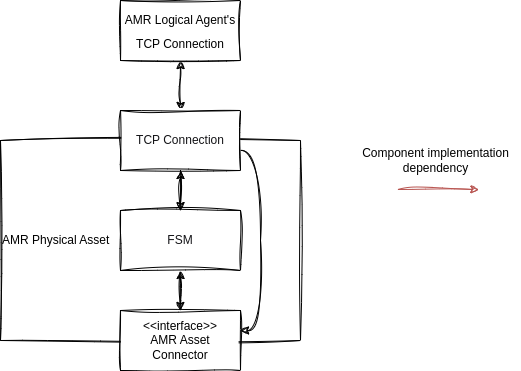

<!--# TODO löschen: Material Flow

Hierarchy

- Material Flow
- Task
- Transport Order, Move Order, Action Order
- Transport Order Step, Move Order Step, Action Order Step

# Optimaflow

- application of sola and surrounding algorithms
- multiple [Material Flows](./material_flow.md)
- multiple AMRs
- multiple Loading Stations and Unloading Stations -->

# Autonomous Mobile Robot (AMR)

AMRs are mobile robots that can execute tasks in a logistics context without human interaction.
For our purposes they are able to follow a predefined path and also execute special actions they are designed for.

To function in a [CPPS](../intralogistics.md) every AMR has a [logical](#logical) and a [physical](#physical) component.
<!-- 
<figure markdown>
  
  <figcaption markdown>**Figure 1:** Components and messages</figcaption>
</figure> -->

## Logical

The AMR Logical Agent is a smart participant in the [CPPS](../intralogistics.md).
It is the AMR's interface to the communication middleware and other agents.
It will

- aquire [Tasks](../glossary.md#t) using specified [Algorithms](optimization.md),
- report the status of Task execution to the corresponding [Material Flow Logical Agent](material_flow.md),and other participants
- aquire map/topology informations and send those to the [AMR Physical Asset](#physical)
- report the AMR's state and position to other agents (cpps) and
- Send [Transport Orders](../glossary.md#t) in form of a list of [Transport Order Steps](../glossary.md#t) to the AMR Physical Asset

- STN (Simple Temporal Network)

### Communication with Material Flow Logical Agent

The communication interfaces depend on where the AMR Logical Agent is run.
It can be run either on the robot's hardware or on a server.

<!-- Is this part of Material Flow Logical Agent? -->

- SOLA connection
- AMR Logical Agent can run on robot Hardware using a wifi connection
- AMR Logical Agent can run on a server using a direct or hardwired connection
<!-- * TODO there's more -->

## Physical

The AMR Physical Asset is the [AMR Logical Agent](#logical)'s interface to the real AMR.
It will receive Orders from and send informations to the AMR Logical Agent through the TCP Connection.
The AMR Physical Asset can handle one Order at a time.
The Order will be represented by a series of [Functionalities](#functionality).

To manage an Order's state during execution the AMR Physical Asset uses a finite state machine (FSM).
The FSM relays the Functionalities through the Asset Connector and handles progress updates the AMR Physical Asset receives whenever a Functionality is finished.

<!--
- simple
- only one Transport Order at a time, no queuing
- send the vehicles Description containing information about kinematics, general vehicle properties and special abilities to the AMR Logical Agent
- report AMR Status Updates consiting of the AMR's state (idle, working, error) and position to the AMR Logical Agent 
  will be offered other participants
- manage the execution of one [Transport Order](../glossary.md#t) at a time.
  Transport Orders are described in [Material Flow](./material_flow.md).
- report AMR Transport Order Updates, which are events that occurred related to the execution of Transport Order, to the AMR Logical Agent
- forward Transport Order Steps to execute to the real AMR as described in [Communication with real or simulated robot](#communication-with-real-or-simulated-robot)
-->

<figure markdown>
  
  <figcaption markdown>**Figure 1:** Components and messages</figcaption>
</figure>

### Functionality

A Functionality is a simple representation of an action the robot can perform.
There are 4 types of Functionalities that are used to execute Order Steps:

- **Move To**: Move to a position.
  This does not differentiate between empty movement and transporting a payload and is used to execute a Transport Order Step or Move Order Step.
- **Load**: Load a payload at the current position and is used to execute a Transport Order Step or Action Order Step.
- **Unload**: Unload a payload at the current position and is used to execute a Transport Order Step or Action Order Step.
<!-- TODO Navigate is unused. Delete? -->
- **Navigate**: Move sequentially to multiple waypoints.
  This does not differentiate between empty movement and transporting a payload.

### Finite State Machine (FSM)

The Finite State Machine represents the state of the current Order.
It will start in state _10 Finished_, which corresponds to the AMR's idle state.
The Finite State Machine assumes to process a Transport Order that is part of a Material Flow created by a Material Flow Logical Agent and was already queued by the AMR Logical Agent.
Therefore the first state it enters is _1 Started_.

<figure markdown>
  
  <figcaption markdown>**Figure 1:** Components and messages</figcaption>
</figure>

The AMR executes Functionalities in states:

- _2 GoToPickUpLocation:_ MoveTo pickup location
- _4 Load:_ Load payload at pickup location
- _6 GoToDeliveryLocation:_ MoveTo delivery location
- _8 Unload:_ Unload payload at delivery location

Some states will only be used to notify the AMR Logical Agent and then be traversed to the next state that executes a functionality.
Those are:

- _1 Started:_ Order execution has started
- _3 ReachedPickUpLocation:_ MoveTo has finished, pickup location reached
- _5 Loaded:_ Load payload has finished
- _7 ReachedDeliveryLocation:_ MoveTo has finished, delivery location reached
- _9 Unloaded:_ Unload has finished
- _10 Finished:_ Order execution has finished, the AMR is idle and can execute the next Order

All states are transitioned in order from 1 Started to 10 Finished for a Transport Order.
There are extra transitions between:

- _5 Loaded_ and _2 GoToPickUpLocation:_ because a Transport Order can load payload multiple times
- _10 Finished_ and _1 Started:_ because the FSM will remain in _10 Finished_ for the last executed Order until another Order to execute is received

### Communication with AMR Logical Agent

#### Message Types

For the communication between the following message types are used:

- **AMR Description** contains information about kinematics, general vehicle properties and special abilities
- **AMR Status Update** contains the AMR State and position
- **Topology** contains the borders of the navigatable space
- **AMR Order Info** contains a series of [Functionalities](#functionality) and the Ability requiement to execute the Order
- **AMR Order Update** contains the current Order State and the AMR's position

#### Handshake

The AMR Logical Agent opens a TCP socket.
As soon as the AMR Physical Asset knows the socket it connects to it and sends the AMR Description and an AMR Status Update (_1 Started_).
<!-- AMR Logical Agent sends nothing back -->

<figure markdown>
  
  <figcaption markdown>**Figure 1:** Handshake between AMR Logical Agent and AMR Physical Asset</figcaption>
</figure>

#### Regular and periodic Communication

If

- the AMR Physical Asset is not executing an Order and the AMR Logical Agent is assigned a new Task **or**
- the AMR Physical Asset finished excecuting an Order and the AMR Logical Agent has another Order queued for execution

the AMR Logical Agent sends an Order to the AMR Physical Asset.
The AMR Physical Asset will then start to send AMR Status Updates periodically to announce position changes and start executing the Order.
Each time the AMR Physical Asset's FSM changes states it will send an AMR Order Update to the AMR Logical Agent.
The first AMR Order Update will contain the _1 Started_ state from the transition from _11 Finished_.

If the AMR Logical Agent is assigned another Task while an Order is beeing executed it will queue the Task.

<figure markdown>
  
  <figcaption markdown>**Figure 1:** Communication during Order execution between AMR Logical Agent and AMR Physical Asset</figcaption>
</figure>

### AMR Asset Connector

The AMR Asset Connector is used to communicate with real or simulated robot.
It is an interface to be implemented depending on the underlying system using the PImpl programming technique (see [cppreference.com](https://en.cppreference.com/w/cpp/language/pimpl)) to hide the implementation.
It offers the following functions:

- **execute**: execute a Functionality and call the callback function on completion.
  Both Functionality and callback function are given in its parameters.
- **get Position**: get the AMR's position
- **get Pose**: get the AMR's pose <!-- TODO Glossary Pose: position and orientation -->
- **get Velocity**: get the AMR's velocity vector
- **get Acceleration**: get the AMR's acceleration vector
- **get / set Topology**: get / set the underlying system's Topology or Map
- **get Description**: get the AMR's Description (see [AMR Description](#message-types))

<figure markdown>
  
  <figcaption markdown>**Figure 1:** AMR Asset Connector</figcaption>
</figure>

## AMR Mobility Helper

The AMR Mobility Helper is a class containing static functions to calculate execution durations, traveling distances and AMR's execution time dependent status for given Functionalities or status.
Estimations and calculations use a trapezoid velocity profile that assumes acceleration, deceleration or velocity being constant during movement phases ignoring payload weight.

- TODO: Figure

For Load and Unload Functionalities constant durations are used for the corresponding actions.
Those durations are only dependent on the AMR's load handling unit's parameters.

