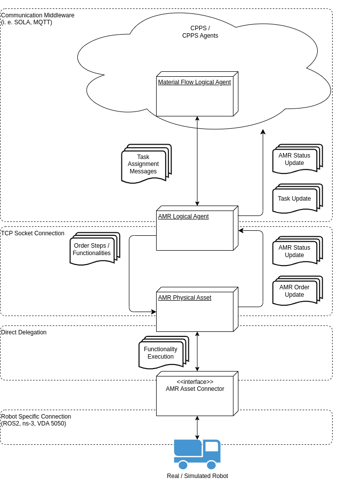
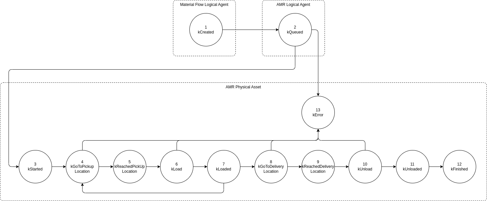

# Autonomous Mobile Robot (AMR)

[AMR](../glossary.md#a)s, also known as [Automated Guided Vehicle (AGV)](../glossary.md#a), are robots that can execute tasks without human interaction. For our purposes they are able to follow a predefined path or even navigate by themselves and also execute special actions they are designed for.

To function in a [CPPS](../intralogistics.md) every AMR has a [logical](#logical) and a [physical](#physical) component.

\
**Figure 1:** Components and messages

# Logical

The AMR Logical Agent is a participant in the [CPPS](../intralogistics.md). It is the AMR's interface to SOLA and will

- aquire map informations and send those to the [AMR Physical Asset](#physical)
- aquire [Transport Orders](../glossary.md#t) using specified [Algorithms](optimization.md),
- report the status of transport order execution to the corresponding [Material Flow Agent](material_flow.md),
- report the AMR's state to other agents and the [Management Overlay](../../../minthon/docs/) and
- handle [Path Planning]()
- handle additional AMR actions like
  - moving to a waiting position or
  - battery charging

As shown in **Figure 1**

# Physical

The AMR Physical Asset is the representative of the real AMR. It is the [AMR Logical Agent](#logical)'s interface to the real AMR and will

- send information regarding kinematics, general vehicle properties and special abilities to the [AMR Logical Agent](#logical)
- report the AMR's state and position to the [AMR Logical Agent](#logical)
- manage the execution of Transport Orders
- report events that occurred related to the execution of a Transport Order to the AMR Logical Agent
- relay tasks to execute to the real AMR

As shown in **Figure 1**

# Managing Transport Orders

Each Transport Order will traverse the following states:

1. Created
2. Queued
3. Started
4. GoToPickupLocation
5. ReachedPickupLocation
6. Load
7. Loaded
8. GoToDeliveryLoacation
9. ReachedDeliveryLocation
10. Unload
11. Unloaded
12. Finished

A Transport Order is created in a Material Flow Logical Agent, will be queued in a AMR Logical Agent and will traverse all other states in a AMR Physical Asset as shown in **Figure 2**. All state changes will be reported upwards to the Material Flow Logical Agent.

\
**Figure 2:** States a Transport Order traverses, grouped by components that cause the transition.
