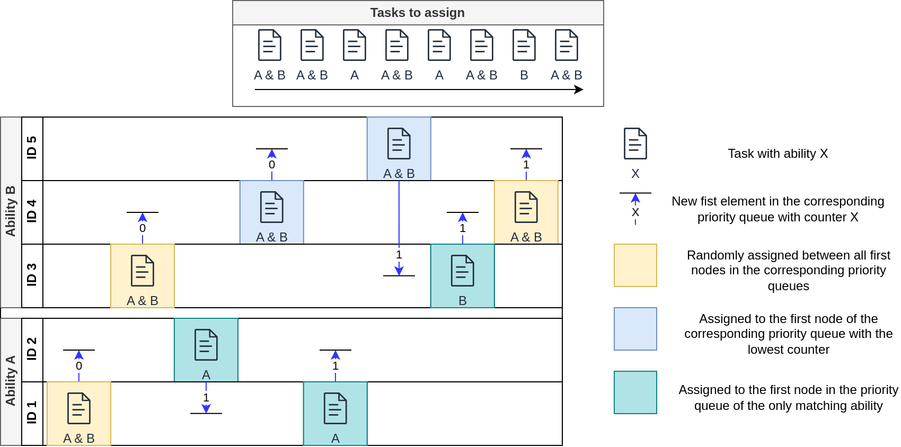

# Centralized Optimization -- Round Robin
- Idea: Logic of task assignment completely centralized
- heterogenous Round Robin
- Simple Approach with no respect to AMR metrics
- Baseline for further central algorithms

## Concept

UML-class chart here

### CentralizedParticipant
This class represents interaction possibilities of a participant within a central task assignment procedure. Since the task assignment is moderated centrally, the participant is designed in a reactive way, waiting for and respoding to messages from the central optimizer. A new task is assigned to the participant via an `AssignmentNotification`. When receiving this message, it is tried to add the contained task to the participants `(Simple?)OrderManagement`, checking wether the assigment can be accepted. Since the round robin strategy should be as simple as possible, there is no case where a task could not be accepted here. The answer including the new metrics is set back to the central allocator via an `AssignmentResponse`.

When a `StatusUpdateRequest` is received, the participant's current metrics are calculated via its `OrderManagement` and are sent back as a `StatusUpdate`. Since the participants states are not relevant for round robin, this should never be the case.  

### CentralizedInitiator
- Abstract class 
- represents central task assignment algorithm

### RoundRobinInitiator
- Central task allocation algorithm
- implements (modified) round robin strategy
- Priority queue per task ability
- knows all participants
- no respect to participant metrics
- ParticipantInfoRoundRobin: struct to store all algorithm-relevant data per participant

**Figure 1:** Round Robin task assignment with 5 participants, divided into two abilities A, B.

## Interaction
- Task Assignment starts when RoundRobinInitiator receives MFDLScheduler (addMaterialFlow)
    - invoked by CppsManager
    - for each task, assignTask(task) is called
        - calls `chooseParticipantForTask` where the specific task assignment strategy is implemented (Round Robin)
        - sends message `AssignmentNotification` to the chosen participant
- Waits a specific delay for all answers
- CentralizedParticipant sends `AssignmentResponse` after receiving the task assignment
    - always true for the `SimpleOrderManagement`
- All unaccepted task assignments are rescheduled
    - should only happen if there was package loss / node failure

