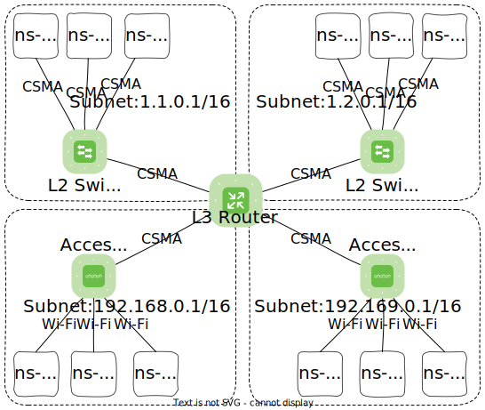

## Simulation setup

So called ``Manager`` classes are used to set up and run the simulation.
Common tasks like setting up randomness, logging and running the ns-3 simulation are implemented in a ``Manager`` base class.
For every application, a specific manager is implemented, which for example parses the specific scenariofile and schedules all required ns-3 events for the application.
Methods of the specific manager are called from the base class ``Manager`` as depicted in Fig. 1.

<figure markdown>
  
  <figcaption markdown>**Figure 1:** Simulation setup</figcaption>
</figure>

## Scenariofile parsing
A YAML scenariofile is represented by a struct, inheriting from ``GeneralScenariofile``.
``GeneralScenariofile`` already provides access and parsing capabilities for all general scenariofile entries, like ``delay``.
Application-specific entries can be added by adding members to the struct.
The member must be named exactly like the entry in the YAML scenariofile.
Parsing happens in the constructor by calling the ``SERIALIZE_VAR`` macro for every member.

Currently, parsing of all basic data types is supported out of the box.
Further,  ``std::vector``, ``std::optional`` and ``std::variant`` can be parsed.
For parsing a ``std::variant`` see [this example](https://github.com/iml130/sola/blob/8007aa76bd5800b5932ef82bf2301c5da4ea33f2/daisi/src/minhton-ns3/minhton_scenariofile.cpp#L49-L66).
To parse a custom class, this class must implement ``void parse(YAML::Node node)``, which calls the ``SERIALIZE_VAR`` macro for every member.

<figure markdown>
  
  <figcaption markdown>**Figure 2:** Example scenariofile structs</figcaption>
</figure>

## Logging

To capture data output from all SOLA components, loggers for the components were implemented that log the data into a SQLite database.
SQLite databases typically reside in files.
Using SQLite allows to inspect the output of the distributed system in a single file and directly allows querying the data with SQL for evaluation.
Further, it eases the evaluation of multiple independent simulation runs as one file only contains data from one simulation run.
As multiple SOLA components share a simulation run (for example SOLA with MINHTON and natter subcomponents), all components log into the same database.

A global instance of the `daisi::LoggerManager` class holds the SQLite database connection and allows creating loggers for each SOLA component.
All those loggers use this connection.

Some general data about the simulation is logged with every SOLA component (see Figure 3 for the tables and their columns).
This gives an overview about which SOLA components or applications are running on which device.
With every SOLA component and application having its own UUID, the mapping of the component's or application's UUID to the device it is running on is logged once.
This allows for example the evaluation of the load per node/device, that is running multiple components or applications.
The naming of the tables and columns (including the unit prefixes) follows [our SQL Styleguide]().

<figure markdown>
  
    
  <figcaption markdown>**Figure 3:** Structure of general logging information</figcaption>
</figure>

Additional data, that is specific to SOLA components and applications, is logged into the database as well.
The structure and content of this data is described under the "Logging" section for each SOLA component or application in the left sidebar.

### Specify output path for simulation results

The path where the output database file should be stored can either be specified by setting the `output_path` key within the scenario file (see "Scenariofile" sections in the left sidebar) or by setting the `DAISI_OUTPUT_PATH` environment variable.
If both are set, `output_path` from the scenariofile is used.

The name for the database file is automatically generated and contains the name of the application or SOLA component, a timestamp and a random six-character string.
Database files from simulations using the MINHTON component also include the fanout and number of nodes in its filename.
If the simulation fails, the database will be labeld with a `.fail` postfix, except if catching fatal errors is disabled with the `--disable-catch` flag (used for debugging only).
While the simulation is running and writing to the datbase, the file is postfixed with `.tmp`.

!!! danger "Wait until the simulation finishes!"

    Do not open ``.tmp`` databases while the simulation is running as they may become corruped.

### Deferred logging

As the simulated time usually runs way faster than the real time, much data must be logged within a small amount of time.
This results in a heavy I/O workload.
To avoid slowing down the simulation due to this high I/O (single SQL statements to insert a single row), DAISI supports deferred logging.
This can be enabled with the CMake option `DAISI_SQLITE_DEFERRED_LOGGING`.
When using deferred logging, the SQL command to insert data is not executed directly but first buffered in memory.
When the buffer gets full, all buffered commands are executed in a separate thread, not blocking the main simulation thread with logging I/O.
One drawback of this approach is, that when the simulation crashes, it is possible that not all data is logged to the database.

## Reproducability

Reproducability of the simulation is important for re-evaluating results and allowing easier debugging of programming or algorithmic flaws.
For this, a seed must be set in the scenariofile (see "Scenariofile" sections in the left sidebar) which is used to initialze a global random generator (`daisi::global_random_engine`).
This random generator can be accessed by all parts that require randomness, resulting in a deterministic simulation.

## Decoupling ns-3 and real world code

One of the main development goals is to let the application run in simulation but also in a real world deployment.
Hence special care must be taken to decouple simulation specific code to allow an easy switch between these environments.
These parts mostly concern:

- Threading: In ns-3 simulation, only a single thread is available for the entire simulation. To call a function after a period of time or async, it can simply be scheduled.
  In a real world deployment however, multiple threads may exist even for a single node, which must be handled correctly.
- Networking: For simulation the ns-3 specific networking functionality like `ns3::Socket` must be used.
  For real world deployment, real sockets must be used, which might also behave slightly different.
- Randomness: For simulation, a random engine is available to provide global randomness but in a reproducable and deterministic way (see [Reproducability](#reproducability)).
  But for real world deployment every node must use its own random generator which should be seeded uniquely for every node.
  One example of what could happen otherwise is, that every node on startup will generate the same UUID for itself, as they are using the same seed independently of each other.

This was solved by providing two different implementations of the same class, where one implementation uses the ns-3 simulator functionalities and the other uses "real-world" functionalities.
When building SOLA, most components are therefore built twice and the required one (simulation or real world) is linked into the resulting simulation executable or real-world library.
If classes need something specific to simulation or real world deployment in their declaration (for example members or private methods taking specific objects), they are further encapsulated using the PImpl idiom.

## Network structure

A device is called "node" within the ns-3 context.
A ns-3 node can run one or multiple (user) applications.
Such nodes are in the following called application nodes.
Currently DAISI supports application nodes to either be connected via the ns-3 CSMA model (ethernet-like connections) or the ns-3 Wi-Fi model (IEEE 802.11).

Application nodes, that should connect to the network via CSMA, are connected to a separate ns-3 node representing a L2 switch.
Every L2 switch can handle a specific number of connections to application nodes, specifiable with the `kNumberOfAppNodesPerSwitch` constant.

Application nodes, that should connect to the network via Wi-Fi, are attached to an access point.
Every access point can handle a specific number of connections to application nodes, specifiable with the `kMaxNumberAmrsPerAp` constant.

The number of L2 switches and access points are automatically scaled up accordingly to the number of application nodes.
The L2 switches and access points are connected through CSMA links to a central ns-3 node representing a L3 IP router.
This setup forms a star topology as shown in Fig. 4.

<figure markdown>
  
    
  <figcaption markdown>**Figure 4:** Example DAISI network structure with nodes connected via CSMA and nodes connected via Wi-Fi. The number of application nodes per switch/access point is set to 3.</figcaption>
</figure>

The specific network parameters (throughput, delay, ...) are currently hardcodeded within the network setup code.

As most of the applications used with DAISI are not handling network failures yet, ns-3 traces are installed to automatically stop the application if network failures happen (packet lost, connection lost, ...).

To avoid such cases and to speed up simulation, the ARP table of every node is prefilled.
This avoids execcsive ARP traffic that could be caused by Peer-To-Peer applications if all nodes within the same subnet communicate with each other.

### IP address ranges

- Core routers IP always ends with `.1`

- Wired networks:

  - 1.1.0.0/16
  - 1.2.0.0/16
  - 1.3.0.0/16
  - ...

- Wireless network
  - 192.168.0.0/16
  - 192.169.0.0/16
  - 192.170.0.0/16
  - ...
