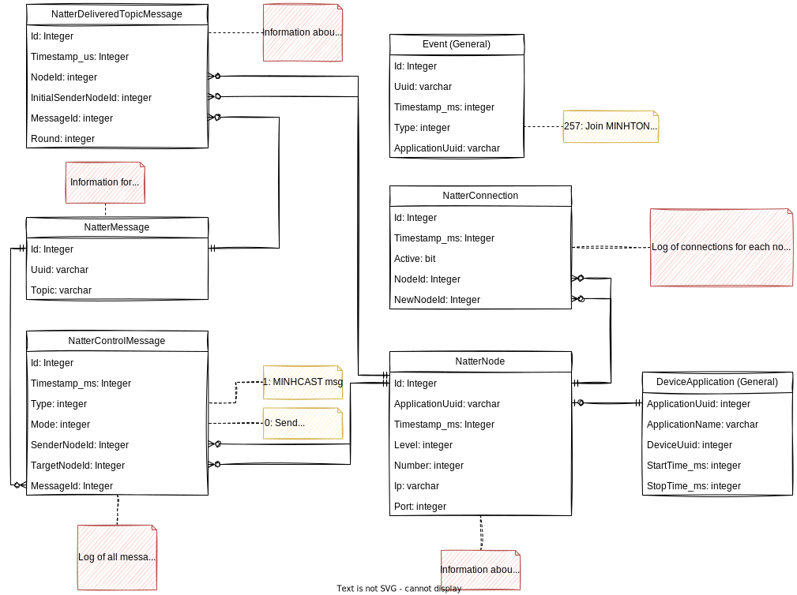

<figure markdown>
  
    
  <figcaption markdown>**Figure 1:** Database structure for logging natter data with ns-3. Red boxes contain descriptions for the corresponding table.</figcaption>
</figure>
