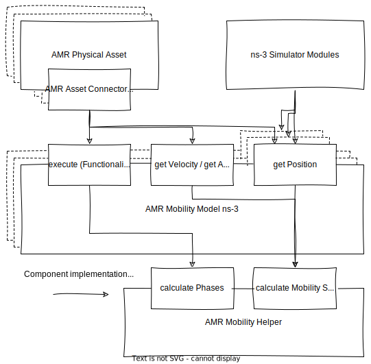
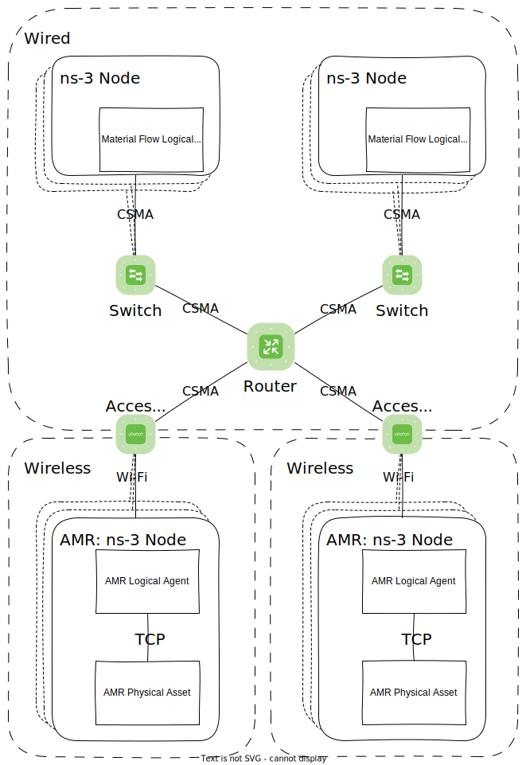

!!! danger "This is work in progress!"

# Implementation Specifics

This page contains information about ns-3 specific implementation details.

If you want to learn more about OptiMaFlow go to the [OptiMaFlow tab](../../optimaflow/introduction.md).

## AMR Mobility Model

There is exactly one AMR Mobility Model for every AMR Physical Asset.
The AMR Physical Asset is connected to the AMR Mobility Model through its AMR Asset Connector.

The ns-3 Simulator also uses get Position to do i. e. signal strength calculations.

AMR Mobility Model offers the abilities to

- execute a Functionality
- get Position
- get Pose
- get Velocity
- get Acceleration

The AMR Mobility Model's abilities use the [AMR Mobility Helper](../../optimaflow/participants/amr.md#amr-mobility-helper) to calculate the AMR's status.

<a name=fig1></a>

<figure markdown>
  
  <figcaption markdown>**Figure 1:** Dependencies related to AMR Mobility Model ns-3</figcaption>
</figure>

### Event driven movement simulation

Each [Functionality](../../optimaflow/participants/amr.md#functionality) will be represented by a sequence of AMR Mobility Status.
An AMR Mobility Status that consists of

- an AMR Movement State (_Accelerating, ConstSpeedTraveling, Decelerating, Stationary, Idle_; _Stationary_ means that the AMR is stationary while doing something else in contrast to being _Idle_)
- an acceleration vector
- a velocity vector
- a position
- a timestamp that marks the instance when the AMR Mobility Status is entered

Each AMR Mobility Status in the sequence marks the beginning of a phase during which the AMR has a constant AMR Movement State.
The next AMR Mobility Status in the sequence also marks the end of the previous phase.
The last AMR Mobility Status in a sequence is always an _Idle_ phase.

The AMR Mobility Helper calculates those phases for a given Functionality.

For a Move To Functionality the [AMR Mobility Helper](../../optimaflow/participants/amr.md#amr-mobility-helper) uses a trapezoid velocity model that has three phases:

- _Accelerating_,
- _ConstSpeedTraveling_,
- _Decelerating_.

Load and Unload Functionalities only have a _Stationary_ phase.

The ns-3 Simulator Modules check the AMR's position for different purposes at different times.
To be able to calculate the position or status at a specific time the AMR Mobility Model ns-3 holds the current phase in an AMR Mobility Status variable and calculates the current status using the phases AMR Mobility Status as the base of the calculation.

If for example the current phase is a _ConstSpeedTraveling_ phase, the current position `c.position` is the phase's AMR Mobility Status position `p.position` plus the distance vector travelled until the current timestamp `c.timestamp`.

```
c.position = p.position + p.velocity * (c.timestamp - p.timestamp)
```

To change the phases at the right time an event is scheduled in the simulator at the timestamp of the next phase.

## AMR Asset Connector

The ns-3 specific implementaion of the AMR Asset Connector is the "AMR Asset Connector ns-3".
Since the AMR Mobility Model ns-3 offers equivalent functions, the AMR Asset Connector ns-3 simply delegates the ns-3 dependent functions as shown in [Figure 1](#fig1).

## Networking

OptiMaFlow does not specify where a component runs but for the simulation a decision had to be made.
There are three components:

- Material Flow Logical Agent
- AMR Logical Agent
- AMR Physical Asset

and each instance of those runs in its own ns-3 application.
ns-3 applications run on ns-3 Nodes which are simulated devices with a network connection of some description.

While different configurations would be possible in the current implementation each Material Flow Logical Agent application runs on its own ns-3 Node, while each AMR Logical Agent and AMR Physical Asset application pair shares one ns-3 Node.
Material Flow Logical Agent Nodes use a wired network connection and AMR Nodes connect to the network via Wi-Fi.
AMR Logical Agents and AMR Physical Assets that run on the same Node are connected via a direct TCP connection.

<figure markdown>
  
  <a href=fig1></a><figcaption markdown>**Figure 2:** Components, Devices and Connections</figcaption>
</figure>
