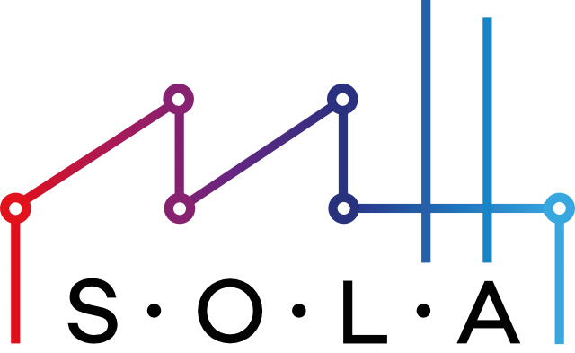

# Introduction

<p align="center">

</p>


!!! info "This documentation is currently incomplete!"

    Any feedback on this documentation is highly welcome, including bug reports,
    typos or stuff you think should be included but is not. 
    Thanks in advance!

**SOLA** is a framework providing Service Discovery and Publish-Subscribe functionalities.
Different components can be used to implement these functionalities.
Initially SOLA was used with distributed peer-to-peer network structures and algorithms as the components, like [MINHTON](management_overlay/introduction.md) and [MINHCAST](natter_lib/introduction.html).
Hence, it omits the need for a dedicated communication instance like a message broker.
But due to the flexibility of SOLA, centralized approaches are supported as well.
All supported components and their SOLA-specific implementations ("connectors" between the components and SOLA) are described [here](sola/component_implementations.md).

<figure markdown>
  <a></a>
    
  <figcaption markdown>**Figure 1:** High-level SOLA architecture</figcaption>
</figure>

This repository contains some components itself, which could also be used outside of SOLA.
Furthermore, we also provide an application that is using SOLA to demonstrate its feasibility.
See [Project Structure](#project-structure) for more information about these.

For instructions on how to build and run SOLA and its components, see [Getting Started](getting_started.md).


## Project Structure

The SOLA repository contains multiple subprojects:

- **SOLA (Standalone)** is the framework that initializes and uses different components to offer a Service Discovery and Publish-Subscribe API.
- **[MINHTON](management_overlay/introduction.md)** is a peer-to-peer management overlay which organizes peers in an optimized tree structure. MINHTON is a SOLA component for service discovery. 
- **[natter](natter_lib/introduction.md)** is a framework for peer-to-peer Publish-Subscribe algorithms.
The MINHCAST algorithm to broadcast a message to all nodes in a MINHTON network is included in natter.
natter is a SOLA component for Publish-Subscribe.
- **SolaNet** is a basic asynchronous UDP networking and utility library.
- **[OptiMaFlow](applications/optimaflow/getting_started.md)** is an application in the domain of intralogistics that uses SOLA to schedule transport tasks to autonomous mobile robots.
- **[DAISI](daisi/introduction.md)** provides the integration of the aforementioned components into the network simulator ns-3, a discrete-event network simulator for Internet systems.
We are using ns-3 as the development and simulation environment for SOLA and its components.

## Contribution to the Documentation

SOLA is an open source project, and as such all contributions, both in the form of feedback and content generation, are most welcomed.
Keep in mind that this project is open source and licensed under the license specified in the repository.
To make such contributions, please refer to the [Contribution Guidelines](https://github.com/iml130/sola/blob/main/CONTRIBUTING.md).

## Academic Attribution

If you use SOLA for research (or any other purposes), please include one of the following references in any resulting publication.

```plain
@inproceedings{detznerSOLADecentralizedCommunication2023,
  title = {{{SOLA}}: {{A Decentralized Communication Middleware Developed}} with ns-3},
  shorttitle = {{{SOLA}}},
  booktitle = {Proceedings of the 2023 {{Workshop}} on ns-3},
  author = {Detzner, Peter and Gödeke, Jana and Tönning, Lars and Laskowski, Patrick and Hörstrup, Maximilian and Stolz, Oliver and Brehler, Marius and Kerner, Sören},
  date = {2023-06-28},
  series = {{{WNS3}} '23},
  pages = {78--85},
  publisher = {{Association for Computing Machinery}},
  location = {{New York, NY, USA}},
  url = {https://dl.acm.org/doi/10.1145/3592149.3592151},
  abstract = {The transformation from static production facilities into a flexible and decentralized cyber-physical production system (CPPS) is part of the current ongoing Industry 4.0. A CPPS will enable and support communication between people, machines and virtual objects, e.g., as material flow or products, alike. However, communication in CPPS relies often on centralized approaches using a message broker or is not considered at all. We present in this paper the decentralized communication middleware called SOLA with an emphasis on, but not limited to, CPPS. SOLA uses the inherent given capability to communicate of participating nodes and eliminates the need for a central instance. A structured overlay network is created and managed, which appears to its users as a single coherent system. The main building blocks of SOLA are the management overlay and the event dissemination. Within this building blocks, no single peer has a global view and all operations are based on each peer’s local view. The local view represents some selected links to a subset of all peers in the network. In addition to this, we also present how SOLA was developed with the help of the discrete-event simulator ns-3. Finally, we also show how we have used ns-3 to simulate a self-organizing material flow where participants use SOLA to communicate.},
  isbn = {9798400707476},
  keywords = {balanced tree,cyber-physical production system,decentral organized communication,peer-to-peer network}
}
```
