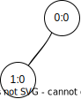

## A simple chat with MINHCAST
!!! note
    
    As the MINHCAST algorithm depends on the MINHTON tree structure externally, as a simplification we will only use two chat nodes on a single topic for this example.

A good starting point to get familiary with the library is the chat example located at ``natter/examples/chat/chat.cpp``.

If you have compiled SOLA according to [Getting Started](../getting_started.md), the chat executable is either located in:

- ``<BUILD_FOLDER>/natter/examples/chat/example_chat`` (without ns-3 integration)
- ``<BUILD_FOLDER>/sola_mono/natter/examples/chat/example_chat`` (with ns-3 integration)

Run the executable in two terminals to create two chat nodes.
The application automatically calls ``subscribeTopic(..)`` on startup and therefore will ask for the MINHTONs level and number of this node.
In a normal integration this information would automatically be provided by the MINHTON node in the topic tree.
But for simplification this must be specified manually here.

Use ``level = 0`` and ``number = 0`` for the first node and ``level=1`` and ``number=0`` for the second node.
This would correspond to this MINHTON network structure:

Afterwards, both nodes must be connected through calls to ``addPeer(..)``.
In the chat example this can be done by executing ``:connect`` and entering the others connection ID afterwards.
The connection ID of the other node can be found in the console output.
Mutually connect both nodes with this method.

Afterwards you can send messages between the nodes like a chat.
Just enter a message and press enter.

## Implement a broadcast algorithm

!!! note

    The [CRTP](https://en.cppreference.com/w/cpp/language/crtp) and [PImpl](https://en.cppreference.com/w/cpp/language/pimpl) idioms are used for the algorithm implementations.

1. Create a new class for the algorithm.
2. Let this class inherit from the template class ``natter::Natter<>``.
Pass the algorithm class itself (CRTP) and a class that should be used to pass node information to the algorithm for the template parameters.
3. In the private section of the class, use the ``DECLARE_CRTP_METHODS`` macro.
This declares all required methods from the parent class, a ``Class::Impl`` class and a member pointer for the PImpl idiom.
4. Create a ``.cpp`` file for your algorithm class.
5. Use ``DEFINE_CRTP_METHODS(C)`` inside the ``.cpp`` file, replacing ``C`` with the name of your algorithm class.
This adds implementations for all methods calls from the parent class and forwards the calls to the ``C::Impl`` class.
The function names and parameters to ``C::Impl`` are the same as in ``natter::Natter``.
6. Declare and implement ``C::Impl``. This is the place where the algorithm logic resides.  

