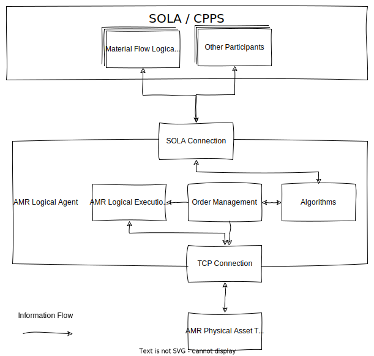
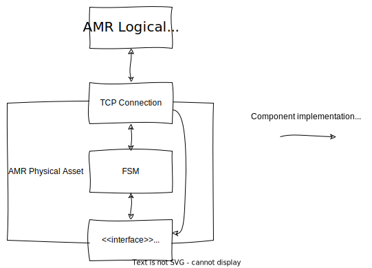
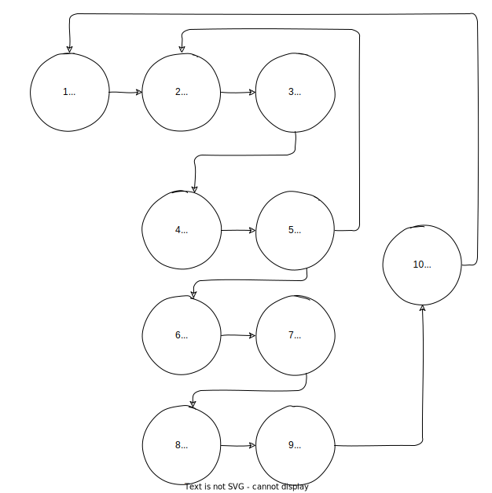
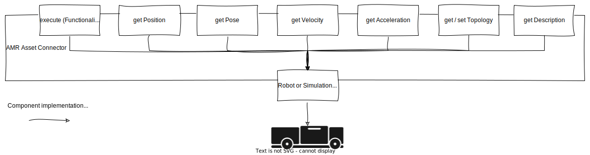
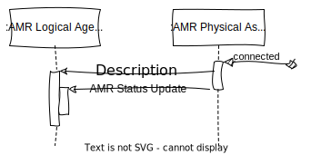
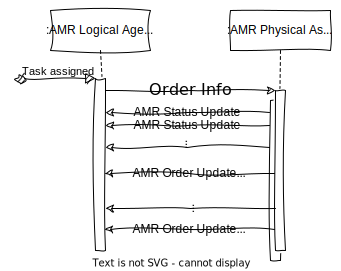

# Autonomous Mobile Robot (AMR)

AMRs are mobile robots that can execute tasks in a logistics context without human interaction.
For our purposes they are able to follow a predefined path and also execute special actions they are designed for.

To function in a [cyber space](../introduction.md) every AMR has a [logical](#logical) and a [physical](#physical) component.

## AMR Logical Agent

The AMR Logical Agent is a smart participant in the [cyber space](../introduction.md).
It communicates with other agents using the communication middleware to make intelligent decisions and manages the AMR's tasks.

It has multiple components shown in the picture below and described in the following sections.

<figure markdown>
  
  <figcaption markdown>**Figure 1:** AMR Logical Agent's Components</figcaption>
</figure>

### SOLA Connection

The SOLA Connection is a socket enabling the AMR to send and receive messages through the SOLA Network.
All sent messages are generated by other components.
And all received messages are forwarded to the Algorithms components.

### Algorithms and Task Management

The Algorithms component handles Task aquisition or assignment from [Material Flow Logical Agents (MFLA)](./material_flow.md).
When a Task is assigned to an AMR Logical Agent the Algorithms component will forward it to the Task Management.

The Task Management holds assigned Tasks in a queue.
Whenever a Task is queued and the AMR is ready to execute it, the Task Management's next Order will be sent to the AMR Physical Asset using the TCP Connection and also send it to the AMR Logical Execution State to manage the Order execution.

It also does cost calculations required by the Algorithms component using the [AMR Mobility Helper](#amr-mobility-helper).

### AMR Logical Execution State

The AMR Logical Execution State holds the AMR's Status and the current Order's State.
When a new Order Update or a new AMR Status Update is received through the TCP Connection it updates the corresponding state.
When a new Order Update is received it is used to check if the current Order is finished and the next Order can be executed.

## AMR Physical Asset

The AMR Physical Asset is the [AMR Logical Agent](#logical)'s interface to the real AMR.
It will receive Orders from and send informations to the AMR Logical Agent through the TCP Connection.
The AMR Physical Asset can handle one Order at a time.
The Order will be represented by a series of [Functionalities](#functionality).

To manage an Order's state during execution the AMR Physical Asset uses a finite state machine (FSM).
The FSM lets the Asset Connector execute the current Functionality and handles progress updates the AMR Physical Asset receives whenever a Functionality is finished.

<figure markdown>
  
  <figcaption markdown>**Figure 2:** AMR Physical Asset's Components</figcaption>
</figure>

### Functionality

A Functionality is a simple representation of an action the robot can perform.
There are three types of Functionalities that are used to execute Orders:

- **Move To**: Move to a position.
  This does not differentiate between empty movement and transporting a payload and is used to execute a Transport Order or Move Order.
- **Load**: Load a payload at the current position and is used to execute a Transport Order or Action Order.
- **Unload**: Unload a payload at the current position and is used to execute a Transport Order or Action Order.

### Finite State Machine (FSM)

The Finite State Machine represents the state of the current Order.
It will start in state _10 Finished_, which corresponds to the AMR's idle state.
The Finite State Machine assumes to process a Transport Order that is part of a Material Flow created by a Material Flow Logical Agent and was already queued by the AMR Logical Agent.
Therefore, the first state it enters is _1 Started_.

<figure markdown>
  
  <figcaption markdown>**Figure 3:** Finite State Machine (FSM)</figcaption>
</figure>

The AMR executes Functionalities in states:

- _2 GoToPickUpLocation_
- _4 Load_
- _6 GoToDeliveryLocation_
- _8 Unload_

Some states will only be used to notify the AMR Logical Agent and then be traversed to the next state that executes a functionality.
Those are:

- _1 Started_
- _3 ReachedPickUpLocation_
- _5 Loaded_
- _7 ReachedDeliveryLocation_
- _9 Unloaded_
- _10 Finished_

All states are transitioned in ascending order from 1 Started to 10 Finished for a Transport Order.
There are extra transitions between:

- _5 Loaded_ and _2 GoToPickUpLocation:_ because a Transport Order can load payload multiple times
- _10 Finished_ and _1 Started:_ because the FSM will remain in _10 Finished_ for the last executed Order until another Order to execute is received and execution is started

### AMR Asset Connector

The AMR Asset Connector is used to communicate with the real or simulated robot.
It is an interface to be implemented depending on the underlying system using the PImpl programming technique (see [cppreference.com](https://en.cppreference.com/w/cpp/language/pimpl)) to hide the implementation.
It offers the following functions:

- **execute**: execute a Functionality and call the callback function on completion.
  Both Functionality and callback function are given in its parameters.
- **get Position**: get the AMR's position
- **get Pose**: get the AMR's pose
- **get Velocity**: get the AMR's velocity vector
- **get Acceleration**: get the AMR's acceleration vector
- **get / set Topology**: get / set the underlying system's Topology or Map
- **get Description**: get the AMR's Description (see [AMR Description](#message-types))

<figure markdown>
  
  <figcaption markdown>**Figure 4:** AMR Asset Connector</figcaption>
</figure>

## Communication between Logical Agent and Physical Asset

The following messages are exchanged between the AMR Logical Agent and the AMR Physical Asset:

- **AMR Description** contains information about kinematics, load handling, general vehicle properties and special abilities
- **AMR Status Update** contains the AMR State and position
- **Topology** contains the borders of the navigatable space
- **AMR Order Info** contains a series of [Functionalities](#functionality) and the Ability requiement to execute the Order
- **AMR Order Update** contains the current Order State and the AMR's position

### Initialization

The AMR Logical Agent opens a TCP socket.
As soon as the AMR Physical Asset knows the socket it connects to it and sends the AMR Description and an AMR Status Update (_1 Started_).

<figure markdown>
  
  <figcaption markdown>**Figure 5:** Initialization between AMR Logical Agent and AMR Physical Asset</figcaption>
</figure>

### Regular and periodic Communication

If

- the AMR Physical Asset is not executing an Order and the AMR Logical Agent is assigned a new Task **or**
- the AMR Physical Asset finished excecuting an Order and the AMR Logical Agent has another Order queued for execution

the AMR Logical Agent sends an Order to the AMR Physical Asset.
The AMR Physical Asset will then start to send AMR Status Updates periodically to announce position changes and start executing the Order.
Each time the AMR Physical Asset's FSM changes states it will send an AMR Order Update to the AMR Logical Agent.
The first AMR Order Update will contain the _1 Started_ state from the transition from _10 Finished_.

If the AMR Logical Agent is assigned another Task while an Order is beeing executed it will queue the Task.

<figure markdown>
  
  <figcaption markdown>**Figure 6:** Communication during Order execution between AMR Logical Agent and AMR Physical Asset</figcaption>
</figure>

## AMR Mobility Helper

The AMR Mobility Helper is a class containing static functions to calculate execution durations, traveling distances and AMR's execution time dependent status for given Functionalities or status.
Estimations and calculations use a trapezoid velocity profile that assumes acceleration, deceleration or velocity being constant during movement phases ignoring payload weight.

<figure markdown>
  
  <figcaption markdown>**Figure 7:** Trapezoid velocity model</figcaption>
</figure>

If the distance is too short to reach maximum velocity, the trapezoid profile will become a triangular profile skipping the constant velocity phase.

<figure markdown>
  
  <figcaption markdown>**Figure 8:** Trapezoid velocity model</figcaption>
</figure>

For Load and Unload Functionalities constant durations are used for the corresponding actions.
Those durations are only dependent on the AMR's load handling unit's parameters.
