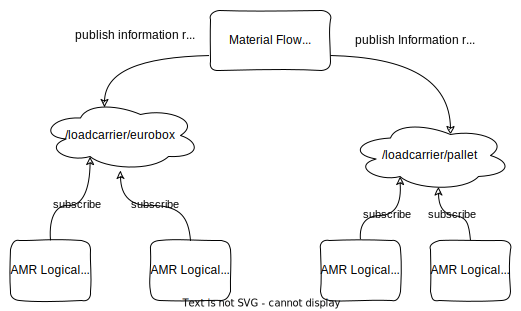

!!!danger "This is work in progress!"

# Decentralized Task Assignment

In the decentralized OptiMaFlow architecture, the task assignment process involves multiple Material Flow Logical Agents, each responsible for managing one or a few [material flows](../participants/material_flow.md#material-flow-description).
This decentralized approach offers several advantages, particularly in terms of improved scalability compared to centralized alternatives.

With decentralized task assignment, the computational load is distributed across individual [AMR Logical Agents](../participants/amr.md#logical) and multiple [Material Flow Logical Agents](../participants/material_flow.md).
This distribution of computational resources ensures that the system can handle a larger number of tasks and AMRs efficiently.
In the decentralized OptiMaFlow architecture, there is no centralized instance available for task assignment.
Instead, the decision-making process is distributed among the participating agents.

To address the Multi-Robot Task Allocation (MRTA) [[1]](#references) problem within the OptiMaFlow architecture, we have implemented a modification of the decentralized task assignment algorithm TePSSI, which will be addressed in the following section.

## The TePSSI Algorithm

The TePSSI (Temporal- and Precedence-constrained Sequential Single-Item auction) [[2]](#references) algorithm is a market-based approach used to handle hard temporal constraints in the form of time windows with an earliest start and a latest finish, as well as precedence constraints represented by a precedence graph that contains each task.
These constraints define the order in which tasks should be executed.

### Market-Based Auction Principle

In the TePSSI algorithm, AMRs can bid for tasks, and the Material Flow Logical Agent assigns the task to the AMR with the _best_ bid.
This auction principle ensures a competitive allocation of tasks.
Meanwhile, the primary goal of the TePSSI algorithm is to optimize task assignment based on a convex linear combination of two factors:

1. Additional Travel Time: The time required by an AMR to incorporate a new task into its schedule.
   The algorithm aims to minimize this additional travel time to improve overall efficiency.
2. Makespan: The time duration required for all tasks to be completed by all AMRs.
   The algorithm seeks to minimize the makespan to ensure tasks are completed as quickly as possible, producing a tight scheduling.

### Task Storage

Once tasks are assigned to an AMR, the AMR Logical Agent stores the tasks in a Simple Temporal Network (STN) [[3]](#references) as an Order Management.
The STN enables efficient representation and management of the temporal constraints associated with task execution.

### TePSSI in the Material Flow Logical Agent

In the context of the TePSSI algorithm, a material flow is transformed into a precedence graph.
Each Material Flow Logical Agent takes responsibility for the task assignment of one such precedence graph in a decentralized manner.
The transformation of the material flow into a precedence graph allows the TePSSI algorithm to handle both temporal and precedence constraints.

### Interaction

Efficient communication is crucial for scalability in large CPPS applications.
In the context of OptiMaFlow, the aim of minimizing communication overhead is addressed through a combination of one-to-one communication and publishing on topics via SOLA with [MINHTON](../../minhton/introduction.md) for interactions involving multiple participants.

#### One-to-One Communication

For interactions that are only relevant to the receiver of the message and not others, the one-to-one communication approach is adopted.
This approach ensures that information is transmitted directly between the sender and the specific receiver, eliminating unnecessary event dissemination to other entities within the system.
By reducing extraneous communication, this method enhances the scalability of the overall system.

#### Publishing on Topics via SOLA

When interactions involve multiple participants requiring the same information, publishing on topics via SOLA is applied.
In this use case, SOLA facilitates efficient event dissemination by employing MINHCAST.
Each AMR group corresponds to a dedicated topic, ensuring that all communication on a given topic is relevant to each subscriber.
This targeted approach guarantees that every participant receives information that is relevant to their physical ability, while avoiding the transmission of unnecessary data to unrelated entities.

<figure markdown>
  
  <figcaption markdown>**Figure 1:** AMR Physical Asset's Components</figcaption>
</figure>

Consequently, the combination of one-to-one communication and publishing on topics via SOLA with MINHTON and MINHCAST enhances the overall efficiency and scalability of the communication within large CPPS applications.

# References

[1] G. A. Korsah, A. Stentz, and M. B. Dias, “A comprehensive taxonomy for multi-robot task allocation,” The International Journal of Robotics Research, vol. 32, no. 12, pp. 1495–1512, Oct. 2013, doi: 10.1177/0278364913496484.

[2] E. Nunes, M. McIntire, and M. Gini, “Decentralized multi-robot allocation of tasks with temporal and precedence constraints,” _Advanced Robotics_, vol. 31, no. 22, p. 1193, Nov. 2017, doi: [10.1080/01691864.2017.1396922](https://doi.org/10.1080/01691864.2017.1396922).

[3] R. Dechter, I. Meiri, and J. Pearl, “Temporal constraint networks,” _Artificial Intelligence_, vol. 49, no. 1, pp. 61–95, May 1991, doi: [10.1016/0004-3702(91)90006-6](<https://doi.org/10.1016/0004-3702(91)90006-6>).
