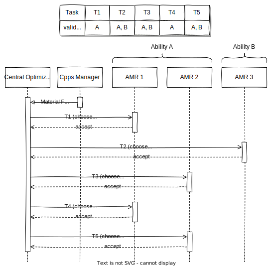

!!!danger "This is work in progress!"

# Centralized Optimization

The idea of a centralized optimizer is to store all relevant information centrally in one place.
The optimizer is responsible to assign all incoming tasks among the known participants.
The global view makes it possible to calculate a global optimum for some specified criteria, e.g., the time when the final task is completed.
Typically a tradeoff must be found between optimality and computational costs.

## Concept

In the centralized scenario, the participants only have to communicate with the central instance by updating their status and reacting onto new task assignments.
The real logic of the task assignment procedure belongs to the central optimizer.
Figure 1 shows the general architecture, where a [Material Flow](../participants/material_flow.md) contains the new tasks to be scheduled while the [AMR Logical Agents](../participants/amr.md)s represent the participants waiting for task assignments.

<figure markdown>
  
  <figcaption makdown>**Figure 1:** Overview of the central task assignment architecture.</figcaption>
</figure>

### Message Types

All message types are exclusively used by one party in the procedure.

- **Assignment Notification (Optimizer)**: assign a task to a chosen participant.
- **Assignment Response (Participant)**: response to the previously received Assignment Notification, containing a boolean stating if the assigment was accepted, as well as a status update.
- **Status Update Request (Optimizer)**: request a participant to send a status update.
- **Status Update (Participant)**: a message containing the AMR's metrics as well as its currently known end location after all assigned tasks are finished.

## Round Robin

The Round Robin Algorithm is a simple approach to decide which participant should be assigned the next task.
The idea is to choose the participant in a cyclic way, i.e. the candidate with the longest waiting time since its previous assignment is chosen.
The AMRs statuses are not taken into account here.
Therefore, the algorithm does not aim to find a global optimum in respect to the total driving distance or the overall finish time.
It is intended to work as a baseline for further centralized optimization algorithms.

### Strategy for heterogenous Round Robin

Even though the AMRs metrics are not respected for this strategy, it is necessary to consider the different AMR types since they have different abilities and might not be capable for a specific task.
To avoid invalid task assignments, the Round Robin algorithm only considers participants with matching abilities.
Moreover, the optimizer only stores information about the total number of tasks assigned to each participant instead of the explicit timestamp of their last task assignment.
This should lead to a more balanced overall load management when considering multiple participant types.

For incoming tasks that can only be handled by one specific type of participants, the task assignment procedure is just as described above while only respecting participants with the correct type.
For the other case, the algorithm chooses a candidate for each different AMR type separately.
Afterwards the candidates are compared with each other and the one with the lowest number of totally assigned tasks is chosen and informed.
In the ambigous case that more than one candidate has the fewest task assignments, a random participant among them is chosen.

### Interaction

As for each centralized approach in this section, the task assignment starts immediately after the optimizer receives a new Material Flow.
Each of the tasks is assigned sequentially as described above by respecting the valid abilities per tasks as well as the total number of assigned tasks per ability.
The selected participant receives the task and tries to add it to it's local Order Management.
The result of this additon (successful or not), followed by the (updated) status is sent back to the optimizer.
Since it is a simplified strategy, a task should always be accepted.
However, if the selected participant's answer is not received after a fixed time, the corresponding task is rescheduled.

The Status updates could be normally sent periodically by the participants to keep the optimizer up to date.
However, since the Round Robin task assignment does not use them, this is not relevant here.
Accordingly, the optimizer will not send any requests for status updates to the participants.

An example interaction with three AMRs, two different abilities and one Material Flow with 5 tasks is shown in Figure 2.
It can be seen that the tasks T2 and T5 are randomly scheduled between the candidates of each ability since the AMRs 2 and 3 had the same number of task assignments at this point.
In contrast to that, task T3 could only be assigned to AMR 2 because it was the selected participant of Ability A while its total number of assigned tasks (0) was lower than for the candidate of Ability B (1).

<figure markdown>
  
  <figcaption markdown>**Figure 2:** Example of the interaction between the Cpps Manager, the Central Optimizer and participants with two distinct abilities during task assignment for a material flow with five tasks.</figcaption>
</figure>
