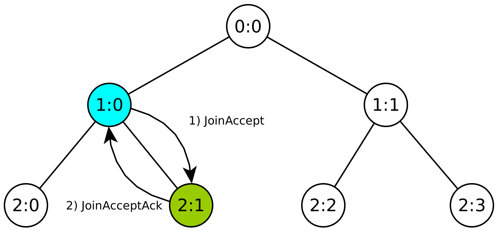
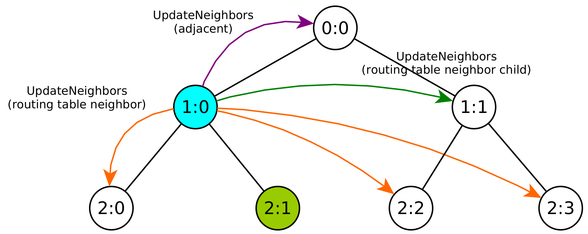
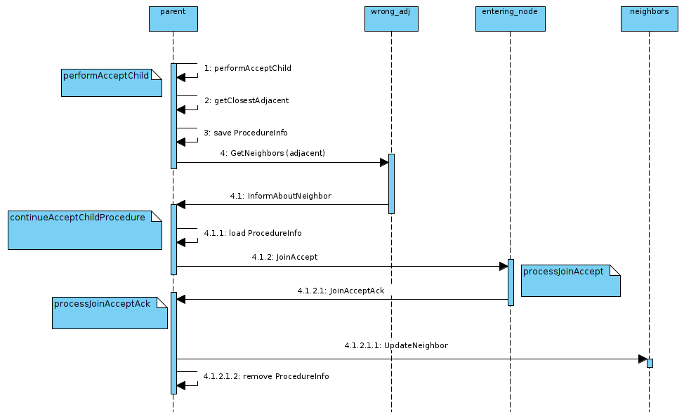

# Join Accept Prodecure

If the JOIN Message reaches a node who can accept the child, the `performAcceptChild` method will be called. The node who receives the Join message will become the parent of the entering node. The parent is responsible of initializing the updating of all routing information within the network. The entering node does not have any other responsibilities other than sending a JoinAcceptAcknowledgement back to the parent.

The parent has to perform the following steps first:

1. calculate the position of its new child / entering node
2. calculate the left and right adjacent neighbors of the new child (-> see Check-Adjacent-Procedure)
3. send a JoinAccept message to the new child
4. receiving the JoinAcceptAck message from the child and updating all routing table neighbors and children within the network

In this example (see [Figure 1](#fig_join_accept_1) and [2](#fig_join_accept_2)) the node who receives the JOIN Message is 1:0. The new child position will be 2:1, because its the only free child position. If there are multiple free child positions, the position which is closest to the center will be chosen. The adjacent left and adjacent right of 2:1 will be 1:0 and 0:0.

The JOIN_ACCEPT Message will contain the left and right adjacent information, the information about the siblings (nodes, who also have 2:0 as the parent) and the sender of the message (who is the parent). The Fanout is also set here.

As the entering node receives the JOIN_ACCEPT Message, it will execute the processJoinAccept Message. Here it will set the given information about the parent, left and right adjacent, and routing table neighbors. It will send a JOIN_ACCEPT_ACK Message back to the parent.

When the parent receives the JOIN_ACCEPT_ACK Message, it will execute the processJoinAcceptAck Method. Here it will actually set the information about the new child in its routing information. It sends multiple UPDATE_NEIGHBORS Messages. Firstly to the adjacents of the entering node (here 0:0), and then to the routing table neighbors (2:0, 2:2, 2:3) and routing table neighbor "parents" (1:1).

This procedure works only if the tree is correctly balanced. If the tree is height-balanced, it will not work, because the nodes on the same level of the entering node could also have children. If e.g. 2:0 has children, 2:1 would need to know about these children as well.

<figure markdown>
  
  
  <figcaption markdown>**Figure 1:** Sending the Join Accept (Ack) message</figcaption>
</figure>
<figure markdown>
  
  
  <figcaption markdown>**Figure 2:** 1:0 sends Update Neighbor messages</figcaption>
</figure>

## Calculating Correct Adjacents

In some cases it might happen that the parent node is not able to calculate the correct adjacents for its new child.
This can only happen for networks with fanout greater than 2 and a larger network size.

In this example (see [Figure 3](#fig_check_adj)) we have a network with fanout 3. Only the important parts of the tree are visualized.
3:15 is the parent who is responsible for the joining of node 4:45. The green lines represent the correct adjacent connections.
3:15 was able to calculate the correct adjacent left 1:1 for its previously entered child 4:46, because 3:15 had 1:1 as its adjacent left itself.
But after 4:46 entered, the adjacent left of 3:15 changed to 4:46 and 3:15 does not know 1:1 anymore.

Now 4:45 wants to join the network and its position is to the left of 4:46. 4:45s adjacent left has to be 1:1, but 3:15 does not know 1:1 locally anymore. The closest adjacent left for 4:45 it knows is 4:44 through the routing table neighbor children. This conenction is wrong though and it is possible to notice through tree mapper calculations that 1:1 is in between 4:44 and 4:45 and that 1:1 is closer to 4:45 than 4:44. But we also can see that 4:44 has 1:1 as its right adjacent neighbor.

Therefore 3:15 can ask 4:44 who its adjacent right neighbor is. This is done through the exchange of GetNeighbors and InformAboutNeighbors messages.
After 3:15 has received the information about 1:1, it finally knows the correct adjacent left for 4:45 and can send the JoinAccept message to 4:45 with its correct adjacent neighbor information. The join accept procedure can continue as before.

Because we had to interrupt the procedure while waiting for the InformAboutNeighbor message (as you can see in [Figure 4](#fig_check_adj_sequence)), we introduced the ProcedureInfo class in which we can store locally information about procedures which were interrupted. When we send the GetNeighbors message we store our information about the calculated adjacent neighbors. When we receive the InformAboutNeighbor message we can load these information and procede normally.

**Notes**: It is not possible that both adjacent left and right are not known. Only one adjacent might be falsely calculated locally.

<figure markdown>
  
  
  <figcaption markdown>**Figure 3:** Check Adjacents example where an adjacent connection is wrong and the correct adjacent is aquired.</figcaption>
</figure>
<figure markdown>
  
  
  <figcaption markdown>**Figure 4:** Check Adjacents sequence diagram</figcaption>
</figure>
