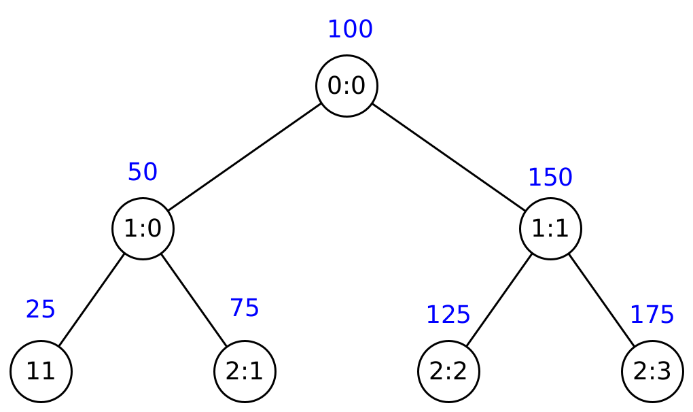

# Tree Mapper

The tree mapper is a recursive function that calculates a value for a node with the given level, number, and fanout.
With this value, you can estimate the relative horizontal position of a node.
This means that you can determine if a node is on the left or right of another node.
The important property of the tree mapper function is that in an inorder traversal through the entire tree (independent of the size of the tree), each node has a smaller tree mapper value than its successor.

The tree mapper is used in the search exact procedure to approximate the closest node toward the destination.

The calculation is implemented as a recursive algorithm in the function `treeMapperInternal` in [`src/core/routing_calculations.cpp`](https://github.com/iml130/sola/blob/main/minhton/src/core/routing_calculations.cpp).

<figure markdown>
  
  
  <figcaption markdown>**Figure 1:** Tree Mapper Example</figcaption>
</figure>
