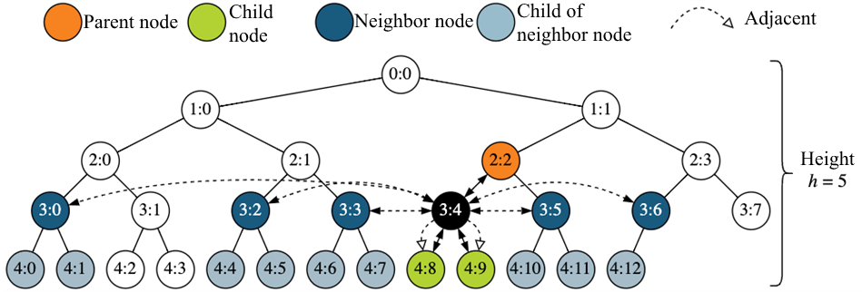

# Using MINHTON

MINHTON is a peer-to-peer management overlay working on the application layer that enables an efficient, decentralized communication by constructing and maintaining a deterministic balanced tree structure.
The integrated search exact for finding peers at given tree positions as well as the peer discovery for finding stored data and more complex retrievals complement MINHTON.

Since MINHTON constructs an overlay network based on a tree, we need to start with a root node.
The root node initalizes the network, but can be replaced later on.
Please note that we do not deal with the physical connection with appropriate listeners between the nodes here, we assume that this is given.

## Code Example

### High Level API

The High Level API can be found in [`minhton.h`](https://github.com/iml130/sola/blob/main/minhton/include/minhton/core/minhton.h).
It is not feature complete yet and may change in the future.

We can create a MINHTON network starting from an arbitrary root node:

```cpp
#include "minhton/core/minhton.h"
#include "minhton/utils/config_node.h"

uint16_t fanout = 2;

int main() {
  minhton::ConfigNode node_config;
  node_config.setIsRoot(true);
  node_config.setFanout(fanout);
  minhton::Minhton minhton_instance{node_config};
}
```

Other participants in the network are then allowed to join like this:

```cpp
#include "minhton/core/minhton.h"
#include "minhton/utils/config_node.h"

int main() {
  std::string known_ip_of_other_node = "0.0.0.0"; // Replace with actual IP

  minhton::ConfigNode node_config;
  node_config.setJoinInfo({JoinInfo::kIp, known_ip_of_other_node, minhton::kDefaultIpPort});
  minhton::Minhton minhton_instance{node_config};
}
```

If a participant should leave the network, you can simply call `#!cpp minhton_instance.stop();`.

### Low Level API

We can initialize the root node in the following way:

```cpp
#include "minhton/core/node.h"
#include "minhton/utils/config_node.h"

uint16_t fanout = 2;

int main() {
  minhton::ConfigNode node_config;
  node_config.setIsRoot(true);
  node_config.setFanout(fanout);
  //node_config.setAlgorithmTypesContainer(algorithm_types_container);
  //node_config.setTimeoutLengthsContainer(timeout_lengths_container);
  minhton::MinhtonNode node{node_config};
}
```

Since the root node creates the network, it has to set the fanout which cannot be changed later on.
The algorithms and timeouts can be freely set to suit different needs.

Feel free to set the fanout to any appropriate value >= 2.
The other nodes need to know the IP address and (if changed) port of any other running node and can join the network like this:

```cpp
#include "minhton/core/node.h"
#include "minhton/utils/config_node.h"

int main() {
  std::string known_ip_of_other_node = "0.0.0.0"; // Replace with actual IP

  minhton::ConfigNode node_config;
  node_config.setJoinInfo({JoinInfo::kIp, known_ip_of_other_node, minhton::kDefaultIpPort});
  minhton::MinhtonNode node{node_config, NeighborCallbackFct{}, true};
}
```

Let's say four additional nodes joined the network.
Then the constructed tree structure would look like the following from a global view:

<figure markdown>
  <a id="fig_four_joins_tree"></a>
  
  <figcaption markdown>**Figure 1:** From a global view, this is a tree with fanout 2 after four additional nodes joined.</figcaption>
</figure>

However, since the nodes only have a limited local view, for example the node 2:0 does not know about 0:0.
The routing information of all nodes are depicted in [Figure 2](#fig_four_joins_routing_info) at this state of the network:

<figure markdown>
  <a id="fig_four_joins_routing_info"></a>
  
  <figcaption markdown>**Figure 2:** The entries in the routing information of the 5 nodes in the network. The physical network information is saved as well for every known node.</figcaption>
</figure>

Since 0:0 is unknown to 2:0, 2:0 needs to search for 0:0 to be able to communicate with 0:0.
This is possible with search exact like this:

```cpp
auto dest_node = minhton::NodeInfo(0, 0, fanout);
minhton::MinhtonMessageHeader header(node.getNodeInfo(), dest_node);
minhton::MessageEmpty query(header);
auto message_query = std::make_shared<minhton::MessageSEVariant>(query);
node.getAccessContainer()->perform_search_exact(dest_node, message_query);
```

The query that should reach the node with unknown network information can be of any message type of the [MessageSEVariant](https://iml130.github.io/sola/doxygen/namespaceminhton.html#typedef-members).

Whenever a node wants to leave the network, it is necessary to initiate a leave procedure so that the tree structure remains consistent.
Algorithmically under the hood this causes a specific forwarding of a message until a replacement node is found that can take over the position of the leaving node.
Only the node on the last position of the tree can freely leave, but still always needs to update the other nodes to prevent invalid routing information.

After a node receives a leave network signal, it initiates the leave procedure.

```cpp
node.processSignal(minhton::Signal::leaveNetwork());
```

If, for instance, node 1:1 requests to leave the network, the last node of the network, currently 2:1, will be found as the successor for the leaving node 1:1.
After the leave procedure and the corresponding updates finish, the tree structure will look like depicted in [Figure 3](#fig_four_nodes).
The updated entries in the routing information of the remaining nodes can be seen in [Figure 4](#fig_routing_info_after_one_leave).
Since the node that was previously located at 2:1 moved to 1:1 to replace it, both positions need to be updated.

<figure markdown>
  <a id="fig_four_nodes"></a>
  
  <figcaption markdown>**Figure 3:** From a global view, this is the tree after 1:1 left and the node previously at 2:1 moved to 1:1.</figcaption>
</figure>

<figure markdown>
  <a id="fig_routing_info_after_one_leave"></a>
  
  <figcaption markdown>**Figure 4:** The entries in the routing information of the 4 nodes in the network. The updated entries after the node, which was previously at 1:1 left, are highlighted in blue.</figcaption>
</figure>

## Entity Search / Peer Discovery

Each node in the constructed peer-to-peer network may have different capabilities and properties.
To find peers with specific capabilities and properties, we use a practical solution to the problem of peer discovery, which is finding peers in the network according to a specified query.
We contribute a peer discovery for an m-ary tree-structured P2P network by utilizing a connected dominating set (CDS), a technique that is typically used in unstructured networks.
Our approach of constructing the CDS requires no additional communication cost, while nodes can insert, update and remove data within O(1).

A peer discovery query description is given according to boolean algebra consisting of logical *and*-, *or*- and *not*-operators.
Literals are comparisons with the key-value pairs (KVPs).
The peer discovery query result is expected to contain information about each peer whose KVPs satisfy the peer discovery query.

## Routing links

<figure markdown>
  <a id="fig_routing_links"></a>
  
  <figcaption markdown>**Figure 5:** The node 3:4 in the example tree with fanout 2 maintains several types of links.</figcaption>
</figure>

Each MINHTON node individually maintains links to selected nodes in the network based on the tree structure and its position in the tree for its local view as follows:

- a link to its parent node (unless it is the root node 0:0).
- links to up to *m* children nodes (*m* also denotes the fanout of the tree).
- a link to a left and right adjcent node based on an in-order traversal.
- links to selected same-level [neighbor nodes in routing tables (RT)](./programmers/concept.md#routingtable).
- links to all children of each same-level neighbor.
