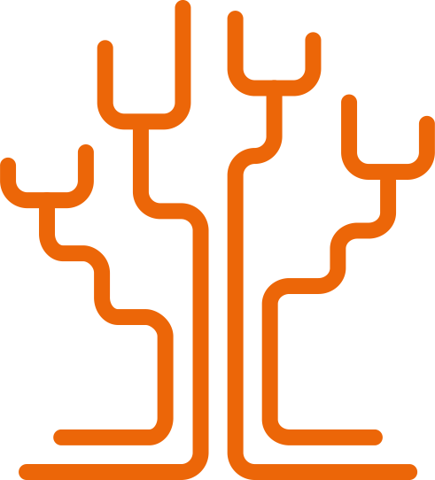
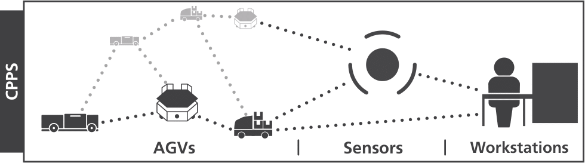

# Minimal Height Tree Overlay Network (MINHTON)

## Abstract

Distributed systems, potentially growing large and consisting of heterogeneous nodes, are advised to be constructed following the Peer-to-Peer (P2P) networking paradigm, like the one in [Figure 1](#fig1).
It becomes imperative that a P2P network is paired with efficient protocols for each phase of its life cycle: construction as well as maintenance and operation.
Three operations are fundamental for a P2P network: nodes must be able to a) join, b) be located, c) leave.
The main challenge for efficient protocols is that a single node will only possess limited information about the network, also known as the local view.
The minimal height tree overlay network (MINHTON) [[1]](#references) is such a P2P overlay architecture featuring several beneficial structural properties added over existing tree-structured networks.
The minimal height guarantees a global tree balance, yet, it must be retained at all times, even though the P2P network may change dynamically.
MINHTON provides efficient protocols for node Join and Departure in logarithmic order, comparable to tree overlays with less strict structural guarantees, both retaining a minimal height tree.

**Figure 1:** An interconnected cyber-physical production system, representing a P2P network.

## References

[1] Patrick Laskowski, Peter Detzner and Steffen Bondorf. 2023. Tree-structured
Overlays with Minimal Height: Construction, Maintenance and Operation.
In Proceedings of the 17th ACM International Conference on Distributed and
Event-Based Systems (DEBS ’23), June 27–30, 2023, Neuchatel, Switzerland.
ACM, New York, NY, USA, 9 pages. (Accepted)
