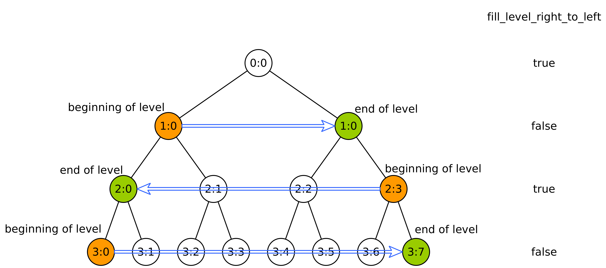
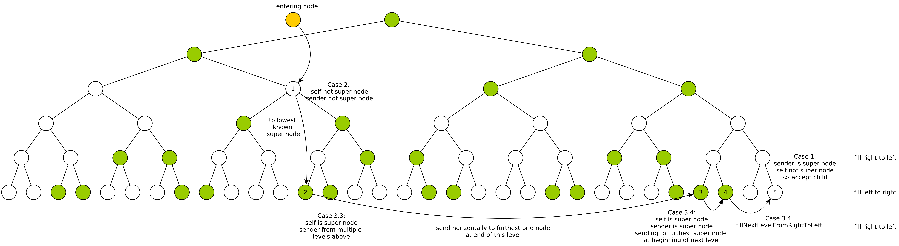
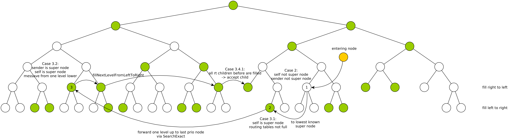

# Outdated information

## Pipeline

**Features written *recursive* aren't implemented yet**

This project uses a continuous integration *and deployment* pipeline utilizing Gitlab CI/CD features.

The main goal is to continuously test the application which helps to spot bugs faster within the development cycle. Furthermore, code quality is checked and suggestions are given.

The pipeline consists of 4 main stages: Build, Testing, Code Quality and Release. Some jobs of these stages run in parallel to speed up execution time.

## Build

### MINHTON build

The libraries, standalone executable and unittest-executables are build in release mode and exported as an artifact.

### Docker images

The pipeline also generates docker images for easy deployment. The images will be published as .tar artifacts and **not** pushed to the container registry because of their large size.
Due to Gitlab Docker runner restrictions we cannot test the images currently.

## Testing

### Unittests

Unittests are used to test certain areas of MINHTON. The results of all unittests are exported to Gitlab and are found on the "Tests" tab.

### Integrationtests
<!-- TODO: Update -->

- **ns3test**: The MINHTON repository is built within the latest minhton-ns3 simulator commit on the development branch. Afterward, the NS3-simulator runs a test-setup and creates a database.
- **standalone Test**: MINHTON as a standalone application is started with a setup of 100 nodes and fanout 5. **Currently only join on root is tested**. The resulting MySQL database is converted to Sqlite3 for further evaluation.

*After both tests the resulting database is checked for errors.*

## Code quality

Cppcheck and clang-tidy is used to check code quality.

- Cppcheck reports are exported as CodeClimate conformant json files. These are read by Gitlab and results are presented on the pipeline "Code quality" tab.
- Clang-tidy reports are exported as yml artifacts and are currently **not** read and presented by Gitlab itself.

## Find Replacement Procedure (nbaton Algorithm)

In order for nodes to be able to leave, it has to be made sure that the removing of their position will not violate the nullbalanced tree structure. Therefore if the removing of their position would violate this, we need to find another node which can replace the node which wants to leave the network and whos removing of their position will not violate the tree structure. Therefore only nodes on the very last level may leave their position. The difficulty now lies in finding out if we are on the last level or not. This will be handled in the `performFindReplacement` method, which contains the implementation of the FindReplacement algorithm.

There are four different cases, which depend on the position of the node in the tree and its neighbors:

**Case 1 - Middle Node**: Our children are full, our routing table neighbors are full, and our routing table neighbor children are full.
We need to forward further down to the lowest node we know.

**Case 2 - Last Level**: Our routing table neighbors are not full, or the FindReplacement contained the flag that we are on the last level.
Then we can leave our position. Sending a ReplacementOffer to the node which wants to get replaced.

**Case 3 - Next to Last Level**: Our routing table neighbors are full, at least one of our routing table neighbor children exists and at least one routing table neighbor child is free. OR one of our children exists and at least one of our children is free.
Then we can forward the FindReplacement message to one of our children or routing table neighbor children and set the flag to true, because we know that one level lower is definitely the last level.

**Case 4 - Next to Last or Last Level**: We are not a middle node, not definitely on the next to last level and not definitely on the last level.
We forward to the furthest prio node at the end of our level. If we are on the next to last level, there would be children being filled up. If we are on the last level, we would notice eventually that we are on the last level and can leave.
(**this approach is probably not correct yet**, we might need to make this similar to the forwarding as in Join Case 3.4)

## Sweep Direction (nbaton Algorithm)

Our goal is to create a null-balanced tree to prevent the need of network restructuring.

We are filling up the levels in an alternating order, either from left to right or from right to left.
This order is signalized by the parameter `fill_level_right_to_left`, which is true for even level numbers.
We start filling up the level at the "beginning of level." Nodes towards the end of the level are being filled up last.
This order is only approximated because some gaps might occur.

The exact join order and performance is highly dependent on the calculation of the prio node set.
(-> see Prio Nodes)

## Terminology

beginning of a level: area where we first start filling up the level

end of a level: area where we filling up the level towards the end

null node: node that has less children than the fanout (new children can join on it)

first prio node: the prio node closest to the beginning of the level

last prio node: the prio node closest to the end of the level

### Basic Principles (nbaton Algorithm)

Overview over Prio Node idea:

| Self is PN | Sender is PN | Case                                 |
|------------|--------------|--------------------------------------|
| 0          | 0            | Case 2 -> forward to PN              |
| 0          | 1            | Case 1 -> accept child               |
| 1          | 0            | Case 3 -> forward to better position |
| 1          | 1            | Case 3 -> forward to better position |

A node which is not a prio node tries to forward the Join message to the next lowest possible prio node.
Those prio nodes then route the message further down if necessary and forward the message to the last prio node on the lowest level which is full. This is the handling level for joins.

### Cases (nbaton Algorithm)

The first part of the sweep join algorithm is to determine the current case we are in (in the `processJoin` method).

**Case 1**: A message from a prio node got sent to ourselves,
and we are not a prio node and the sender is from the same level.
We accept the entering node as child directly.

**Case 2**: We are not a prio node and the sender is not a prio node.
This case should not happen often. We are trying forward to the lowest prio node possible.
Firstly, we try to find the lowest prio node we know and have a direct connection to.
If we do not know such a node, we calculate the first prio node position
one level higher and forward via SearchExact, because this is the level for handling joins.

**Case 3**: We are a prio node. This case has four more sub-cases.
This case should be called most of the time. The execution order of the sub-case condition checking is relevant.

**Case 3.1**: Our routing table neighbors (same level) are not full.
This means that we are on the last level, which is currently being filled up.
We need to send the Join message to a prio node one level above via SearchExact.

**Case 3.2**: Either the sender is from exactly one level below us than us
(through Case 3.1) or the sender is from the same level and the sender is not a prio node
(which happens through the forward in Case 2).
This means that we are the handling level for Joins.
We send horizontally through the level towards the end of this level or start filling up the next level.

**Case 3.3**: The message was sent from multiple levels above, or the sender is the entering node itself.
Forwarding the Join message further down to the next prio node if possible. Otherwise we send horizontally.

**Case 3.4**: The message was sent from the same level and the sender is a prio node.
Therefore we are on the last level and try to forward further to a prio node depending on the sweep direction.
Before that we check if we can accept the child, if every routing table neighbor child before is filled.
This case is called most of the time when we are on the handling level for joins and try to find
the right position across a large level of nodes. If we have reached the the end of the level
and did not find the right position (for whatever reason) we would always forward back to the beginning
of the level and start over seaching the level again.

## Example Join Sequences (nbaton Algorithm)

## New join

We try to approximately fill the levels according to the alternating fill direction.

Some obvious exceptions for the calculations need to be made, for initialization purposes for the first few levels.

The Join message contains a target_on_next_to_last_level flag.

When we are accepting a child, we accept it at the free position which is closest to the middle of the tree
(closest horizontally towards root).

### Calculating Case

Prioritizing target_on_next_to_last_level flag!

Middle Node: CHildren full and Routing Table Neighbors and Routing Table Neighbor Children full

Next To Last Level Node: Routing Table Neighbors full and we know at least one node on level below (from children or rt neighbor children).

Last Level: Dont know any nodes on level below and Routing Table Neighbors not full

Last or Next To Last Level: Not middle node and not last level and not next to last level.

Only one of these 4 cases may be true at any time!

### Notations

Beginning of the level:
Fill Direction is right to left: The PN with the maximum number is the PN at the beginning of the level.
Fill Direction is left to right: The PN with the minimum number is the PN at the beginning of the level.

End of the level:
Fill Direction is right to left: The PN with the minimum number is the PN at the end of the level.
Fill Direction is left to right: The PN with the maximum number is the PN at the end of the level.

Important to keep in mind:
In the next to last level case we always need to consider the fill direction of the next level.
In the last or next to last level case we need to consider the fill direction of the current level.

### Accepting Cases

**Case 0.1**:

We are not a prio node, the sender is a prio node, and the sender is from the same level.
Prio Nodes will only send a message to a non-PN on the same level, if they are sure that its the best decision for them to accept.
Therefore non-PNs just listen to what they are saying.

**Case 0.2**:

We are on the next to last level and know that most likely we are the next node according to the fill direction to accept a child.
We have at least one free child and all our routing table neighbor children before us are filled according to the fill direction.
Therefore we are probably a good position to accept a new child next.

A prio node can also accept a child, in the last_or_next_to_last_level case, when we discover that we are actually on the next to last level.
Also any node on the next_to_last_level could accept a child without violating the nullbalanced condition.
But we want to make sure to approximately stick to the fill direction.
More about that in that case.

### Non Accepting Simple Cases

**Case 1**:

We are a middle node. We forward the message down to the lowest node we know.
OPTION: maybe to the lowest prio node, but just the lowest is probably good enough.

**Case 2**:

We are a node on the last level. We must simply forward the message to a node on the level above,
and set the target_on_next_to_last_level flag to true.
We forward via Search Exact to a prio node, which is the closest horizontally to our furthest known routing table neighbor.
OPTION: maybe its better to forward to a pn at the beginning or end of the level.

### Difficult Cases

**Case 3**:

We are a node on the next to last level. We are the handling level for Joins and a node on this level needs to accept the new child.
Therefore it would be save for any node on this level to accept the child.

If in this case we forward any message to a node on the same level, the target_on_next_to_last_level flag is always set to true.

*Case 3.1*:
If we a a prio node at the end of this level (= begining of the next level), or the message is being forwarded from the beginning according to the filling direction,
and the sender is from the same level, we are forwarding the message to an accepting non-PN, accept ourselves, or forward further in this direction to the next PN.

*Case 3.2*:
Othwerise we are forwarding via SearchExact to the PN at the beginning of this level (= end of next level). We can be sure that this node exists
and can forward will receive the Join Message via SE, because the next to last level is filled.

**Case 4**:

We are a node on the next to last level or last level. We are not sure. Therefore we cannot savely accept a child.
We must first discover which level we are actually on.

We must assume the worst case and assume that this is the last level.

*Case 4.1*:
If the sender is already from the same level, we forwarding around the level.
Forwarding around the level:

- we reached the end of this level and the message came from the beginning of the level
    - therefore we know that this level is filled, because we must have hoped over each pn of this level
    - and we can accept the child or forward to fitting non-PN closest to the beginning of the next level
- we have not reached the end of this level yet and the message came from the beginning of the level
    - forwarding further to the closest next existing PN according to the fill direction

*Case 4.2*:
If the sender is not from the same level, or we could not find a fitting case in 4.1, which means that the direction the message came from was wrong:
We need to make sure that the whole level has been scanned for free positions and need to start at the beginning of the level again.
But we cannot just send via SE, because we are not sure that all nodes on the level exist, and a message may not get lost.
We try to forward to the closest node towards the beginning of the level, if we know such a node.

*Case 4.3*:
We must be at the beginning of the level, if case 4.1 and 4.2 dont match.
We can start forwarding with the fill direction to the next prio node.

### Comments

The number of hops is quite high, because we must make sure that the tree will always stay nullbalanced, and
in the worst case hop over each PN on the last/next to last level.

But with bootstraping the number of hops can dramatically be reduced, by e.g. exploiting case 0.2.
Or only letting nodes where its easy to calculate that they are definitely on the next to last level respond. Because
then we don't need figure out the position in the tree anymore.

The leave algorithm where we need to find a replacing node on the last level can be implemented similarly,
where we need to find a node on the last level and consider the fill direction.

Parts of the join algorithm depend on the Search Exact algorithm.
So if we improve Search Exact, join will improve at the same time.
