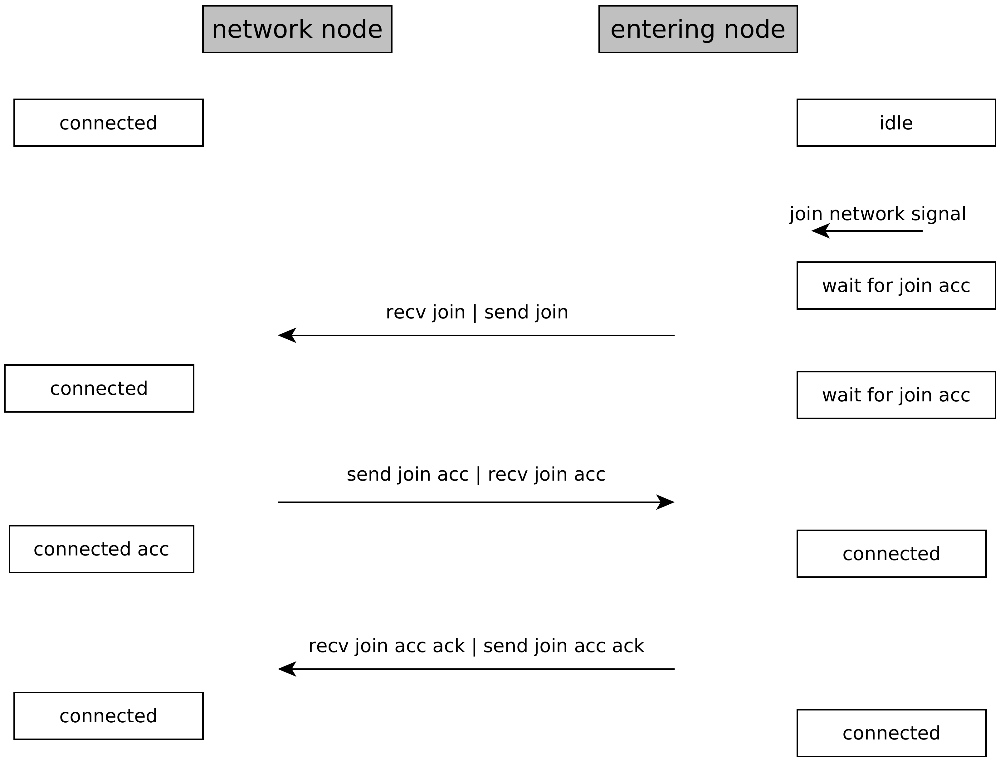
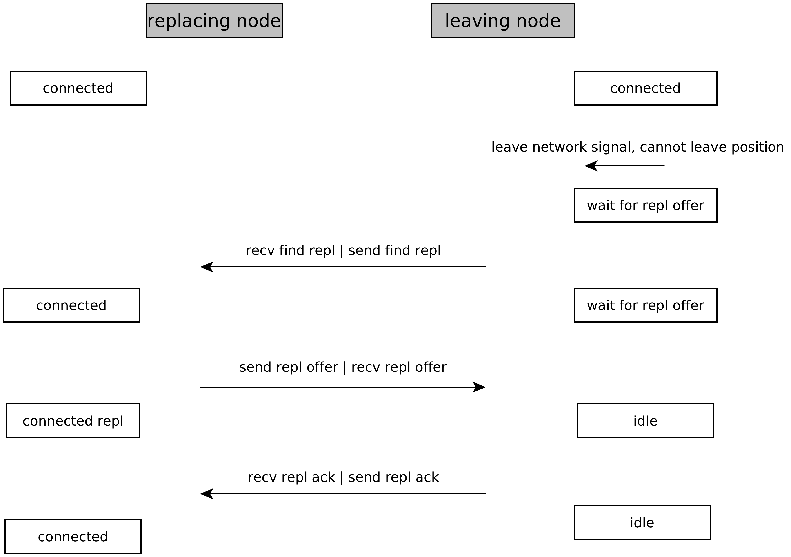
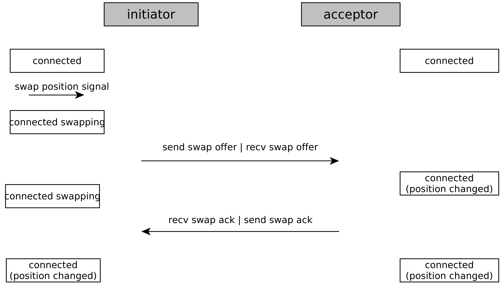

# Finite State Machine

The purpose of the FSM is to prohibit unwanted behaviors such as accepting a child while already in the process of accepting another child, or trying to leave the network while not even being connected.

We are using the fsmlite library, which is a lightweight finite state machine framework for C++11 and can be found [here](https://github.com/tkem/fsmlite).

## Integration

There are 4 types of possible input events for the FSM: sending a message, receiving a message, a timeout expires, or we get a signal from the outside.

Before the MinhtonNode processes an event, the FSM has to process the input event and check if this behavior is allowed, depending on the states and the event.
If the FSM was able to make a transition, the action is valid.
If there was no registered transition avaliable, the action is invalid and something unwanted happend.
At the moment an acception is thrown.
In some cases, we could maybe just ignore the unwanted behavior.

## FSM States

| FSM State                    | Description                                                                                         |
|------------------------------|-----------------------------------------------------------------------------------------------------|
| Idle                         | We are not a part of the network                                                                    |
| Wait for Bootstrap Response  | We try to join and wait for Boostrap responses                                                      |
| Wait for Join Accept         | We have sent the initial join message and are waiting for a join accept                             |
| Connected                    | We are a part of the network                                                                        |
| Connected Accepting Child    | We are a part of the network and currently in the process of accepting a new child                  |
| Connected Replacing          | We are a part of the network and currently in the process of replacing another node                 |
| Wait for Replacement Offer   | We are still part of the network, but are trying to leave and are waiting for a replacement offer   |
| Wait for Parent Response     | We are still part of the network, but waiting for confirmation to become a successor                |
| Sign Off from Inl. Neighbors | We are still part of the network, and sending updates to the inline neighbors to become a successor |
| Error                        | An error occurred which needs to be handled                                                         |
<!--| Connected Swapping           | We are a part of the network and currently in the process of swapping our position                  |-->

## Graph Representation

Only the most important transitions are shown here. Obvious transitions like UpdateNeighbor message in a connected state are omitted here.

<figure markdown>
  
  
  <figcaption markdown>**Figure 1:** FSM Graph Representation</figcaption>
</figure>

## Workflows

### Join via Address

<figure markdown>
  
  
  <figcaption markdown>**Figure 2:** FSM Join Workflow</figcaption>
</figure>

To join the network via a given address, the node transitions first into the wait-for-join-accept state through the join-signal.
There it sends the inital join message into the network to the given address.
At the same time the node sets a timeout.
If he does not receive a join-accept message within the given period, the join accept response timeout gets triggered.
The FSM transitions into the error state, where it needs to be handled how to procede.

If the node recieves a join-accept message fast enough, it transitions into the connected state and becomes an active member of the network.
It still needs to send the join-accept-ack message to the parent.

### Join via Bootstrap

<figure markdown>
  
  
  <figcaption markdown>**Figure 3:** FSM Join with Bootstrap Workflow</figcaption>
</figure>

In the join via bootstrap process is an additional step.
We do not transition straight into the wait-for-join-accept state, but first in to the wait-for-bootstrap response state.
There the node has to wait for a given period of time collecting bootstrap response messages.
After a timeout expires and the node received at least one valid bootstrap-response message, it goes into the wait-for-join-accept state and sends one initial join message into the network.

If the node did not receive a valid bootstrap-response, it does not know an address to join the network properly.
It therefore transitions into the error state.

### Leave with Replacement

Note: **Doesn't include the changes for concurrent operations yet**

<figure markdown>
  
  
  <figcaption markdown>**Figure 4:** FSM Leave with Replacement Workflow</figcaption>
</figure>

The leaving node gets a leave-signal and recognizes that it cannot just leave the position by itself, but needs to get replaced by another node.
This signal triggers the transition into the waiting-for-replacement-offer state, where the leaving node sends out the initial find-replacement message.
From here the leaving node e.g. also cannot accept a child anymore.

If the leaving node does not receive a replacement-offer message within a given period of time, it does back into the connected state - because it is still an active member of the network.
Whether the node should try to leave again needs to be determined from above.

If the leaving node receives a replacement offer fast enough, it goes into the idle state and is not part of the network anymore.
From the idle state it still needs to send the replacement ack back to the replacing node though!

<!--### Swap

The node that is initiating the position swapping is called the initiator.
The node that the initiator wants to swap with is called the acceptor.

After the initiator gets the swap signal, the FSM transitions into the connected-swapping state.
In that state, the initiator is allowed to send the swap offer to the acceptor.
The acceptor receives the swap offer in the connected state.
The acceptor does not transition into the connected-swapping state, because for him the procedure is finished right after processing the swap offer by sending the swap ack. By then the position-swap is done for him.

The initiator receives a swap ack in the connected-swapping state and transitions back into the connected state.
If the initiator does not receive a swap ack within a certain period of time, a timeout gets triggered and the initiator transitions back into the connected state that way.-->

## Further Considerations

In any connected state (where the node is a part of the network), each node must be able to send and receive non-critical messages.
Connected states are: Connected, Connected Replacing, Connected Accepting Child, Connected Swapping and Waiting for Replacement Offer.

Non-critical messages to sending are Join (for forwarding), UpdateNeighbors, RemoveNeighbor, GetNeighbor, InformAboutNeighbor, SearchExact, ReplacementUpdate and FindReplacement (for forwarding).

Non-critical messages to receive are all the same as above plus Boostrap Discover, because any node in the network could potentially receive a bootstrap discover message.

These non-critical messages are all related to other nodes wanting to join/leave/swap and updating the network information.
But they do not change the state of the node sending/receiving the message.

In the Idle State there are Transitions possible, which are related to leave updates.
If a node can leave the network without replacement, it diretly transitions from the connected to the idle state through the leave-signal.
But afterwards it still needs to be able to send update messages about its departure into the network.
This is the only reason why sending UpdateNeighbor, RemoveNeighbor and SearchExact is allowed there.
