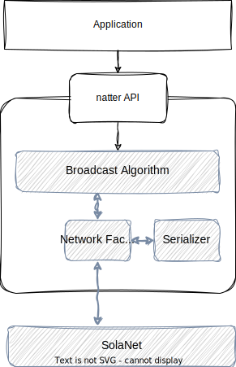

# Architecture

## Networking structure

We introduced the intermediate facade-class ``natter::core::NetworkFacade`` to abstract away serializing and communicating with the low-level network library.
SolaNet is used as a low-level network library.

 
Figure 1: Network structure of natter.

