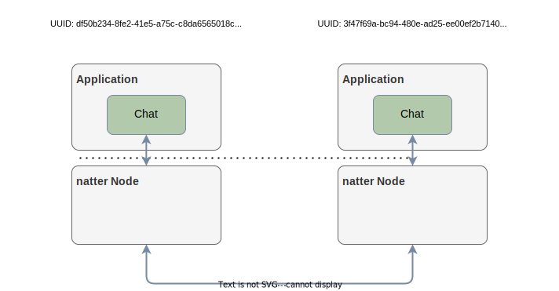

# **natter** chat example

A basic chat-application.

> :warning: Be aware that natter is a pub-sub middleware only.
A single node is dumb and relies on connection data from outside.
Therefore, node discovery and connection setup must be performed one layer above. **For this example the user is responsible for setting up the connections. Connections must be bidirectional!**

## Example Scenario

In our example scenario, we want to connect two chat applications.
The application know each other (due to some yellow pages or a service/resource discovery).
However, we are using a connection id to connect the chats:

- A universal unique identifier (UUID) 
- Network IPv4 Address
- Network Port

Of course, depending on your application this can be created completely different

<center>
<br /> <br />
</center>

## Setting up the chat

First, we need to set up Alice ;)

```shell
./example-chat

Starting chat
Your connection ID: df50b234-8fe2-41e5-a75c-c8da6565018c;192.168.178.109;56407
Use :connect to connect to another peer
Use :quit to exit
------------
>> :connect
>> Enter others connection string: 3f47f69a-bc94-480e-ad25-ee00ef2b7140;192.168.178.109;56734

# After setting up the connection from Bob to Alice
>> Hi Bob!
```

And now we also need Bob:

```shell
./example-chat

Starting chat
Your connection ID: 3f47f69a-bc94-480e-ad25-ee00ef2b7140;192.168.178.109;56734
Use :connect to connect to another peer
Use :quit to exit
------------
>>:connect
>> Enter others connection string: df50b234-8fe2-41e5-a75c-c8da6565018c;192.168.178.109;56407

# Receiving message from Alice
[Alice]: Hi Bob!
```
